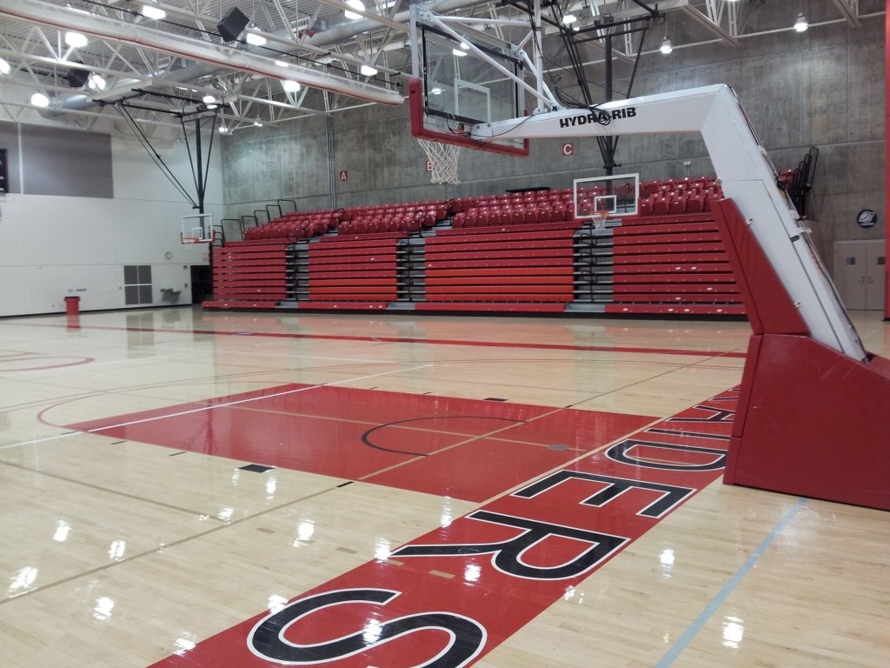
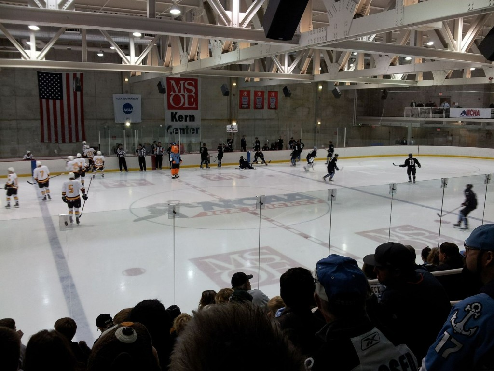
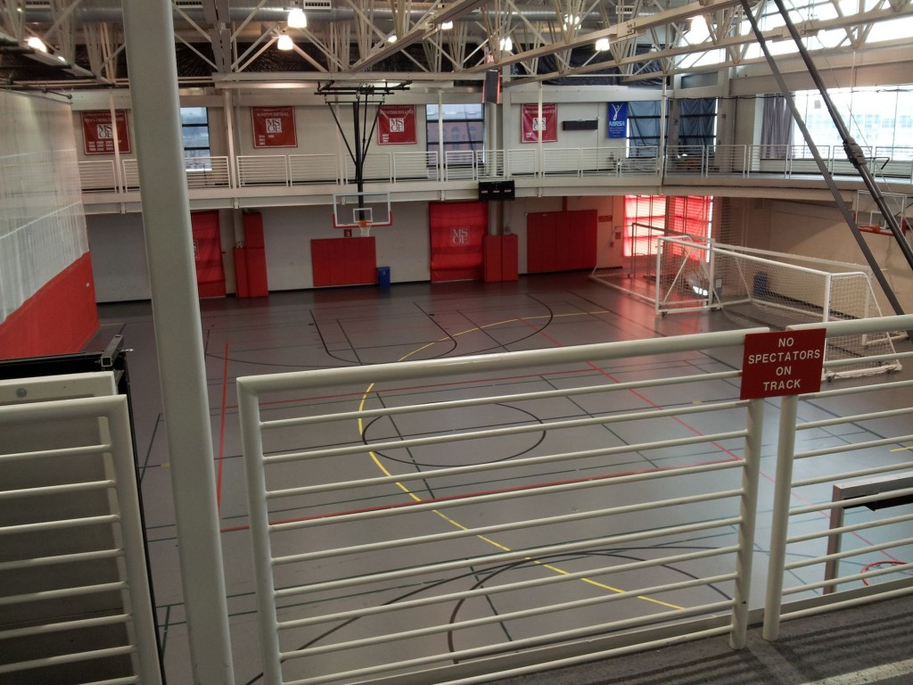
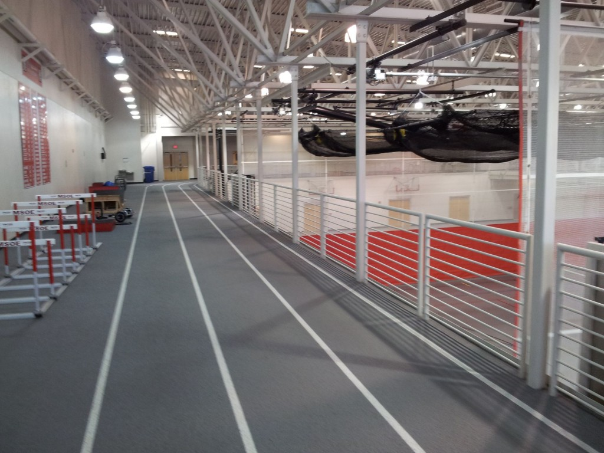
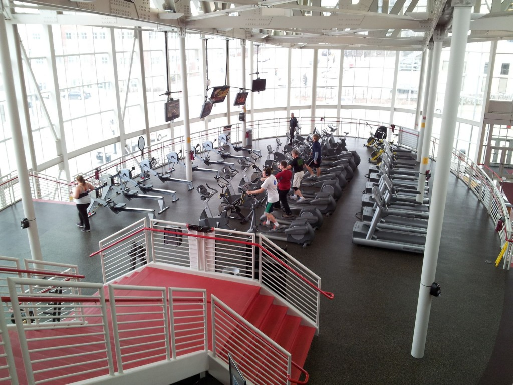
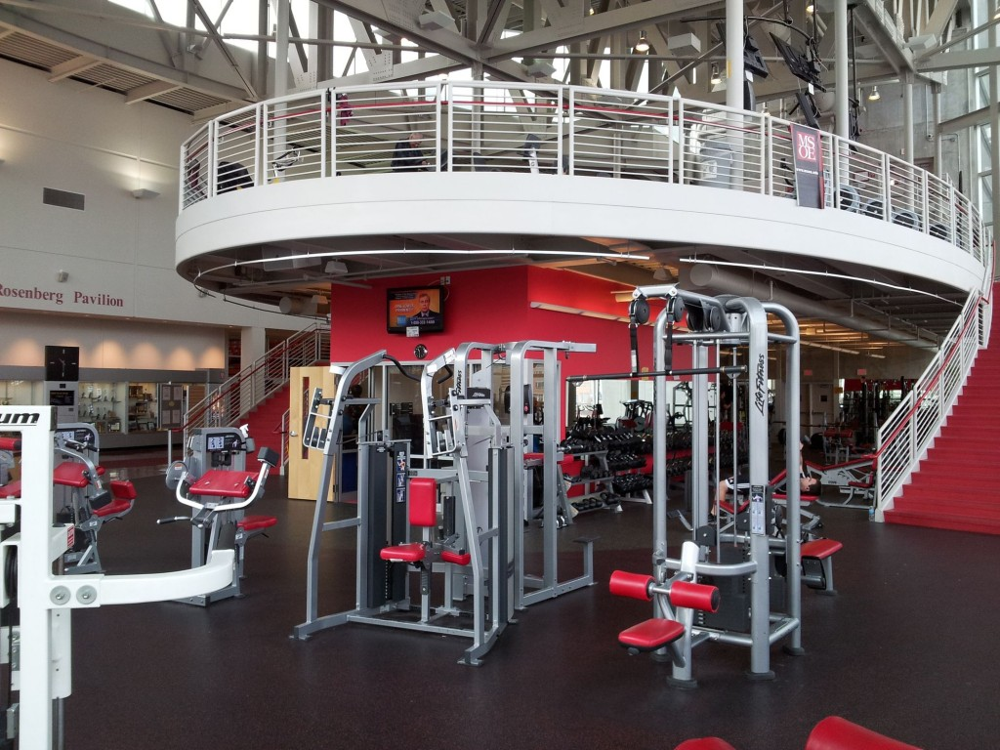
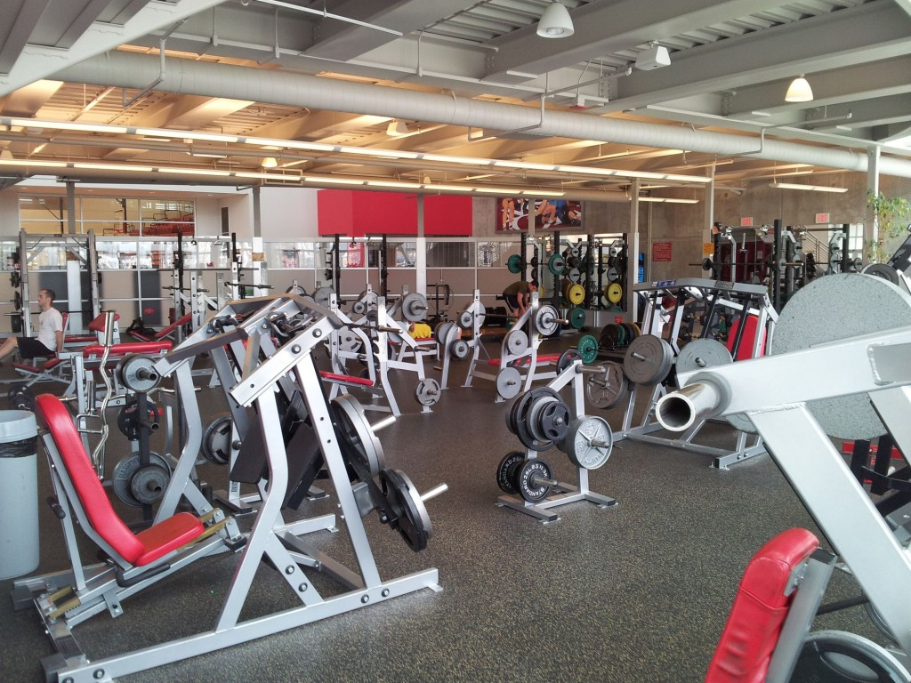

Už jsem tu popisoval [Campus Center](http://blog.miksu.cz/campus-center/), který je takovým středobodem MSOE. Pokud však rádi sportujete, tak budete nejvíce nadšeni z jiné budovy - **Kern Center**. Je to nejnovější školní budova, otevřená před necelými 8 roky. Je to v podstatě jeden velký 5 patrový sportovní komplex, ve kterém je i pár kanceláří. Je otevřený od rána do večera každý den a pro studenty MSOE je **dostupný neomezeně** a úplně **zdarma**. Co všechno zahrnuje? 

Největší hala. Obvykle se v ní hraje basket nebo volejbal. Občas jsou tu i nějaké sešlosti, jelikož se vejde (nejen) na rozkládací tribunu docela dost lidí. 

V nejspodnějším patře se nachází zimní stadion. Téměř každý týden je tu veřejné bruslení, kde vám (zdarma) **půjčí i brusle**. Také tu hraje náš MSOE tým, který je asi tím nejlepším sportovním výběrem, který na škole máme. (Na vlastní fotbalový tým jsme asi moc malá škola.) 

Druhá tělocvična. Jsou to tři spojené hřiště pro tenis, basketbal, volejbal či futsal. Také jsou v ní spouštěcí sítě pro trénování baseballových odpalů. Na fotce jsou ona hřiště oddělena dvěmi spouštěcími zdmi. Konalo se tu také třeba zahájení školního roku. Pokud sem přijdete dopoledne, bude většinou úplně prázdná. Odpoledne se cca půlka košů obsadí lidmi, co si jdou jentak zaházet. 

Ve stejném prostoru se o patro výše nachází běžecký ovál. K dispozici jsou překážky, v jednom rohu boxovací pytle a na další straně i nějaké ty činky, míče, švihadla, podložky a další blbůstky. 

A tohle je cardio plácek. Fajn jsou ty televize - lze si půjčit i bezdrátová sluchátka. Nebo si lidi přinesou knížku, tablet či ipod. Jsou tam rotopedy, běhátka, orbitracky a veslovací trenažery. Pod schody (z pohledu fotky podemnou) jsou opět i žíněnky, podložky, míče a činky. 

A tady už začíná svět těžkého železa. Najdete tu snad všechny stroje. 

Další stroje a za nima spousta činek. 

A nakonec ty i velké činky - bench press lavice, vzpěračské platformy a další kupa strojů. Zas tolik posiloven jsem v Čechách neprošel, ale tahle je určitě ta nejvybavenější a nejhezčí, jakou jsem kdy viděl. Pochopitelně jí navštěvují i lidé mimo MSOE, kteří si za ní normálně platí. Ale i tak je **Kern vždy poloprázdný**. Dopoledne je v posilovně vždy tak max 6 lidí. Co se týče tělocvičen, tak tam je prakticky volno vždy kromě víkendů, kdy si je může pronajmout i veřejnost. Co jsem už nefotil je **tělocvična pro judo**, která je pokryta tatami a pak taky menší **tělocvična pro spinning**.

Samozřejmostí jsou i pěkné šatny a koupelny. Snad jediná věc, která tu chybí je bazén. Ale to už by bylo asi trochu moc pro školu, která má jen 2500 studentů. Však ani ČVUT, který je 10x větší nemá svůj bazén. Pokud si chcete zaplavat, tak musíte vyrazit do města. Bezva na tom také je, že vám **půjčí zdarma i veškeré vybavení** (např. míče na basket či volejbal). Dokonce tu jsme tak pohodlní, že když jdeme hrát tenis, tak jim 15 minut předem zavoláme a oni hřiště sami postaví (nastaví síť, zvednou koše, spustí zeď) a když nás to omrzí, tak jim to tam necháme a oni si to pak zase uklidí. No a třešničkou na dortu je to, že **Kern je přímo na campusu**, což v případě MSOE znamená** přes ulici**. Takže poslední dobou jsem tam skoro každý den (momentálně se snažím střídat posilovnu s tenisem a občas si jdu jenom zaházet na koš). Pokud jde o sportovní vyžití na MSOE, tak je situace naprosto ideální. O podobném zázemí si můžeme nechat u nás jenom zdát.
