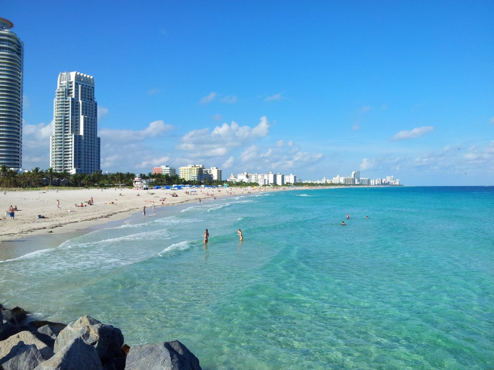
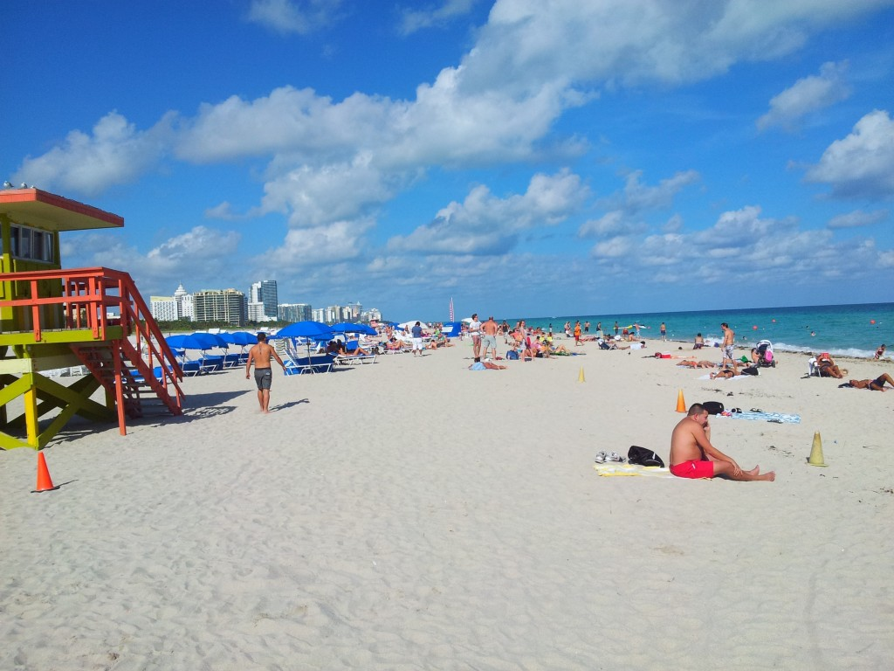
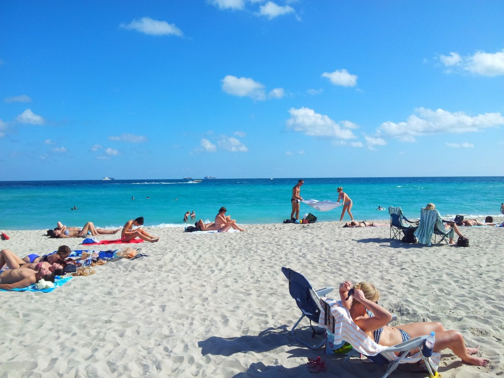

Zlatým hřebem vánoční dovolené byly 4 dny strávené na Miami Beach. Miami Beach je velký a podlouhlý ostrov, který je s centrem Miami spojený mnoha mosty. Na straně, která směřuje do oceánu se rozprostírá přes celou délku ostrova ohromná písečná pláž (přes 10 km dlouhá a cca 100 metrů široká). Mezi 1. a 23. ulicí se jí říká South Beach a patří mezi nejznámější pláže světa. A je opravdu parádní. Písek je krásně čistý a jemný, vstup do moře je pozvolný, vlny jsou tak akorát aby se dalo plavat a zároveň to nebyla nuda, teplota vody málokdy klesne pod 24 stupňů, každých 100m jsou vyhřívané sprchy a pítka a díky velikosti není nějak přeplněná. V jedné části je zpevněnější pruh písku, který slouží autům/4-kolkám = plavčíkům a dá se tak po pláži i dobře běhat. 

V další vrstvě hned u pláže se nachází Ocean Drive, která se skládá jen z barů a restaurací. Ulice která je přeplněná luxusníma autama. Ulice, kde to v Miami v noci asi nejvíce žije. Od 20. ulice do nějaké 50. je zas dřevěná promenáda a jeden hotelový resort za druhým. A za tím vším jsou ještě další 2 ulice, kde už mezi bary občas najdete i nějaký ten obchod či fastfood. 

My jsme bydleli v low-cost hotelu na 17. ulici jen blok od pláže, což je téměř dokonalá lokace. Z hotelu jsem měl celkem respekt, jelikož měl trochu rozpoluplné hodnocení. Naštěstí náš pokoj evidentně prošel rekonstrukcí, takže super. Klimatizace a internet fungovaly, což jsou z mého pohledu asi 2 nejdůležitější věci při životě v Miami. :-) No a jak jsme trávili čas my? Samozřejmě drtivá většina padla na válení na pláži a blbnutí ve vodě. Což bylo naprosto perfektní, jelikož jsem již nějaký ten rok u moře nebyl a šťávu tomu přidával ten kontrast s Wisconsinem, kde je nyní počasí úplně na pytel. Nechápu proč většina lidí jezdí k moři v létě - to je z tepla do většiho tepla. Ale když jedete v zimě, tak je to přechod do úplně jiného světa a je to tak parádní načerpání energie v zachmuřené zimě. 

Taky jsem si byl 2x zaběhat. Plán byl přeběhnout celou Miami Beach tam a zpátky. Nicméně po 11km jsem to vzdal, protože druhý konec byl stále v nedohlednu. No a samozřejmě i nějaký ten noční život proběhl. Btw na pláži se nesmí pít alkohol, používat sklo a je od půlnoci do 5 ráno zavřená, takže se celkem snadno dají porušit hned 3 zákony naráz. :-) A co je na tom všem nejlepší? Tohle je tady celý rok, žádný podzím, zima či jaro. Prostě jenom jedno nekonečné léto, plná pláž a narvané zahrádky. Pokud máte aspoň trochu rádi sluníčko, moře a noční život, tak tohle je místo, kde vás napadne, že už se nikdy nechcete vrátit domů...
