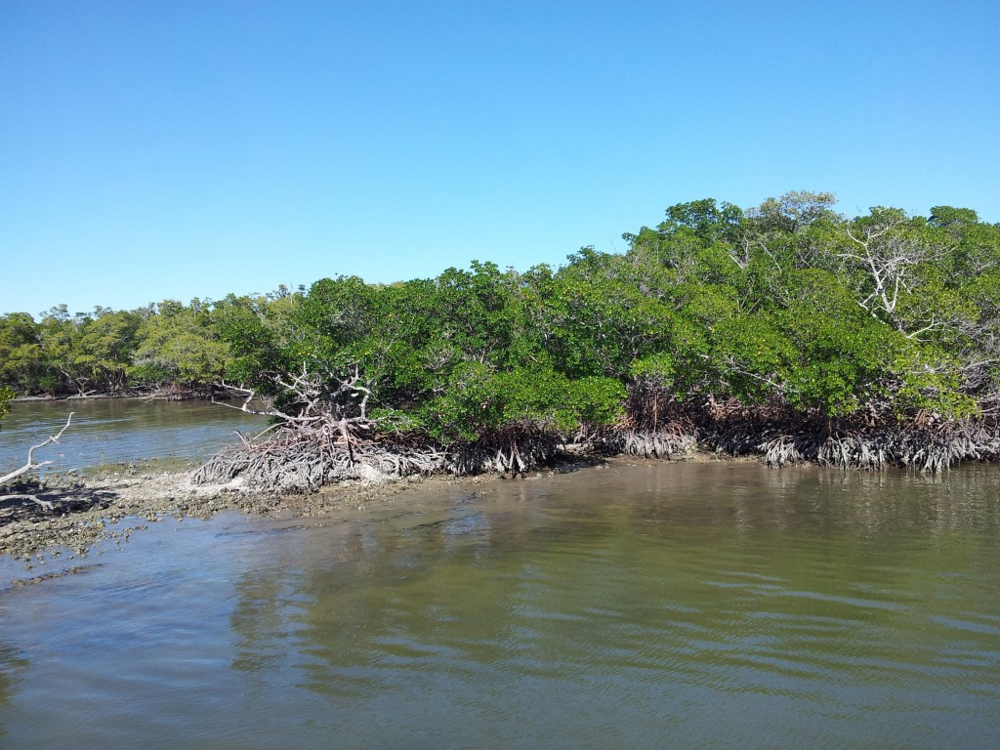
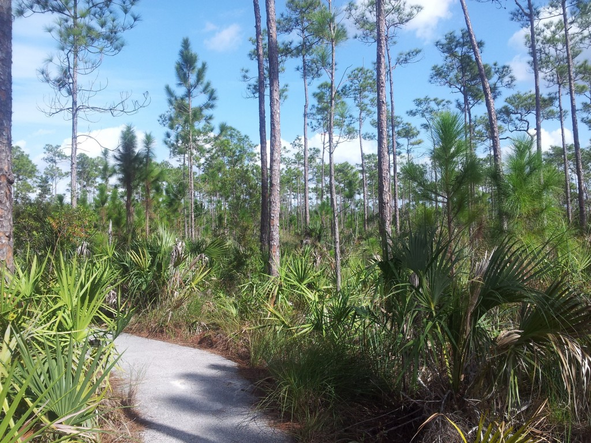
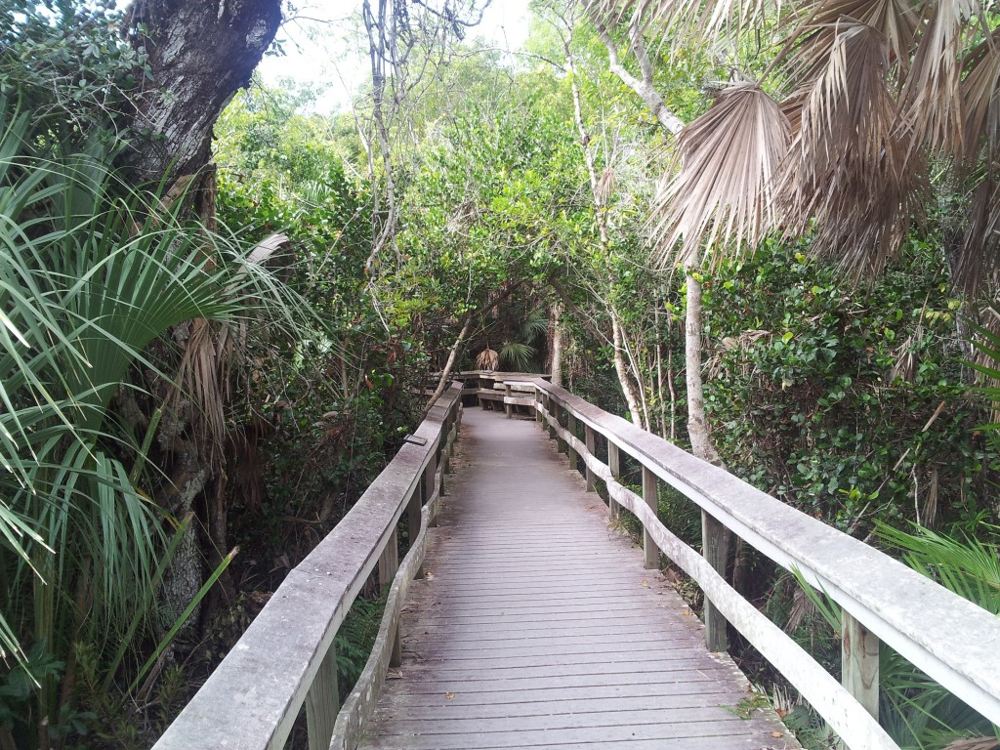
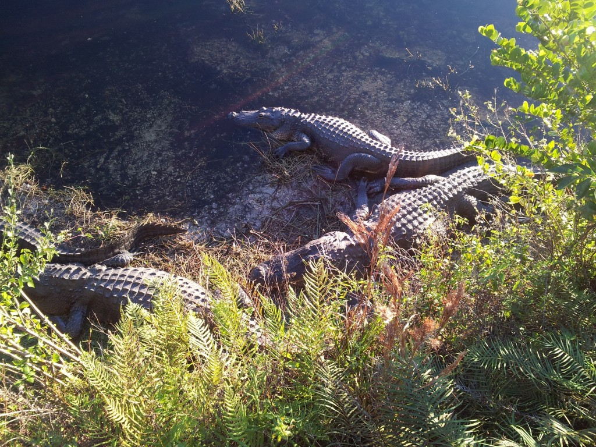
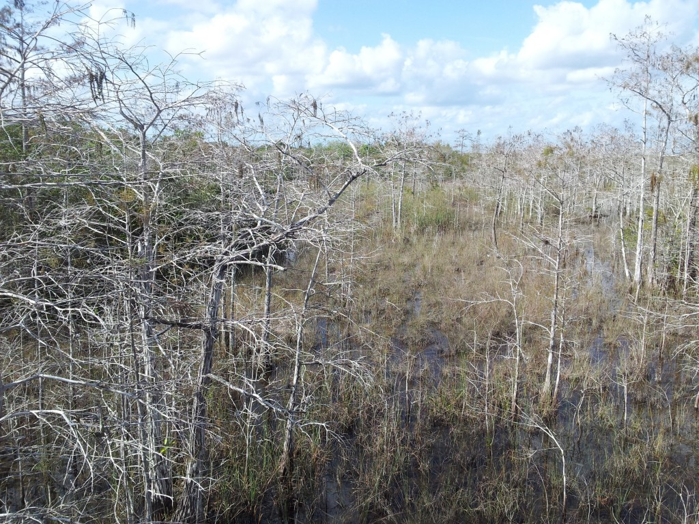
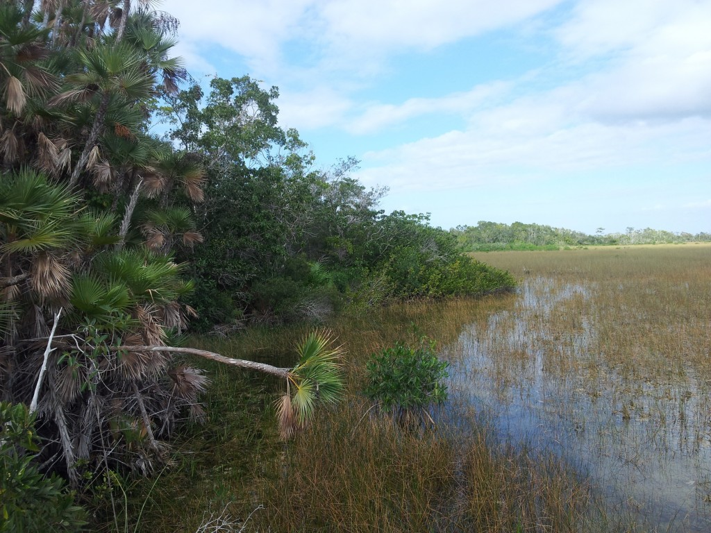

Prozatím bylo cestování po USA jen o poznávání nových měst - [Madison](http://blog.miksu.cz/madison/), [Chicago](http://blog.miksu.cz/chicago/), [Miami Beach](http://blog.miksu.cz/miami-beach/), [Key West](http://blog.miksu.cz/key-west/). Chtělo to tedy okusit i trochu přírody a tak den a půl Floridy padnul za "oběť" národnímu parku Everglades, který zabírá prakticky celou jižní Floridu a tak naše výprava byla spíš jen takovou rychlou ochutnávkou. 

Co je typické pro Everglades? Ze zvířat spousta druhů ptáků (nejvíce byly vidět pelikáni), aligátoři, krokodýli, hadi, želvy, kapusťnáci, panteři, motýli nebo žáby. A to všechno žije v mangrovech, borovicových lesech, močálech, bažinách či různých travách. 

Do Everglades vede několik vstupních bodů. První den jsme se vydali k tomu nejvzdálenějšímu - až na západní pobřeží. Tam jsme nakoupili lístky na vyhlídkovou plavbu, na které jsme toho bohužel moc neviděli - respektive viděli jsme hodně ptáků a mangrovů. Delfíni i kapusťnáci se na nás vykašlali. Chtěli jsme zkusit ještě vznášedla, ale nějak na ně nezbyl čas. 

Cestou zpátky jsme si udělali ještě několik zastávek, na kterých se vyskytovali krokodýli. Je to parádní zvířátko. Nekonečné minuty na něj zíráte a přemýšlíte nad tím jestli je mrtvé nebo živé. Pak konečně pohne jednou nohou a zase další půl hodinu nic nedělá. Nicméně to je jenom taková uspávací taktika, jakmile jde po kořisti, tak je pekelně rychlé - hlavně ve vodě. Samozřejmě všude vás na to upozorňují cedulky. 

Ve jménu dobrodružství jsme nakonec sjeli ze silnice na nějakou lesní zkratku, která byla delší ale za to pomalejší. Aneb v naprosté tmě, uprostřed ničeho a jak jsme zjistili až posléze, tak i bez rezervy. To jsme tedy objevili naštěstí až doma na parkovišti (nepíchli jsme). Aneb v půjčovně krapet lhali. Jednou jsme i vylezli z auta a dokonce viděli i krokodýla face-to-face bez zábradlí či cedulek. Ale ani ten se kvůli nám nepustil do žádných větších akcí (naštěstí?). 

Druhý den jsme na to šli z druhé strany a použili vstup, který je hned u Miami. Tentokrát to bylo více o lesech a jezerech. Probíhá to asi tak, že jedete po normální silnici a z ní vedou semtam sjezdy na odpočívadla, ze kterých se táhne nějaká kratší stezka - většinou lávka kolem něčeho zajímavého. Sice jsme nepotkali žádnou větší zvěř, zato však příroda byla o dost zajímavější. Bohužel v téhle části nejsou dostupná vznášedla. 

Škoda, že nebylo na park více času. Je opravdu rozlehlý. Určitě se vyplatí ho navštívit, jelikož podobný v Evropě (natož v ČR) rozhodně nenajdete.
