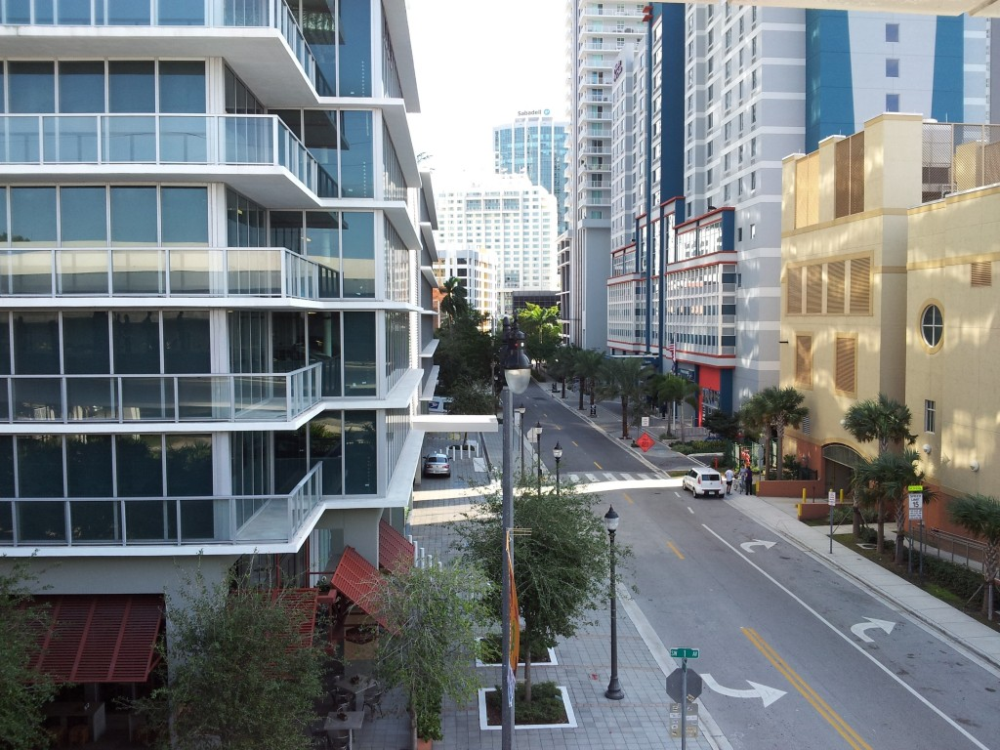
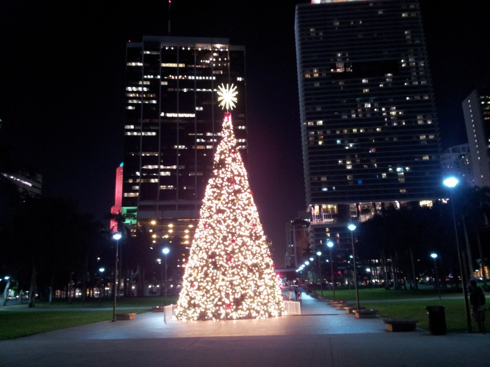
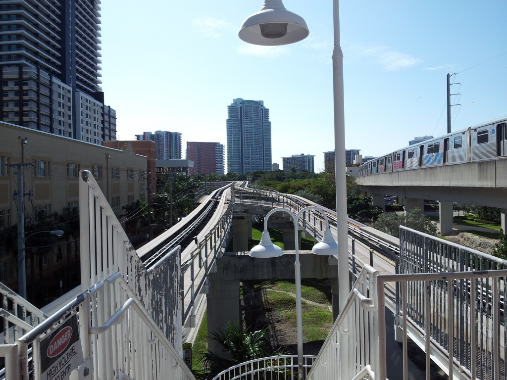

Poslední článek z cyklu dovolené na Floridě. Už jsem tu psal o [cestě do Miami](http://blog.miksu.cz/cesta-do-miami/) a o [Miami Beach](http://blog.miksu.cz/miami-beach/). Avšak pár vět si zaslouží i downtown. Pevninské Miami vypadá jako každé jiné americké velkoměsto - plné mrakodrapů, širokých ulic, aut a lidí. 

Čeho si všimnete hned po přijezdu je to, že se tu anglicky moc nemluví. Většina lidí totiž mluví španělsky a angličtinu lámou jen když musí. Což moc nemusí, jelikož jsou tu například i všechny nápisy a instrukce přeloženy do španělštiny. Dostanete se tak nejednou do paradoxní situace, kdy je v USA velmi obtížné se domluvit anglicky. 

Typicky v jakémkoliv fastfoodu na vás začnou mluvit automaticky španělsky. Měl jsem tak vtipné španělsko-anglické dialogy třeba v Subway, kde už znám z paměti, na co se vždycky ptají. On si povídal španělsky, já anglicky + rukama a dali jsme to dohromady. :) Pokud bych měl žít v Miami dlouhodoběji, určitě by to chtělo se naučit alespoň základy. A ani by mi to nevadilo, páč španělština je pěkný jazyk. :) 

Světlou stránkou Miami je doprava. Fungují tu autobusy a klasické metro. Navíc je tu však bezplatné automatické (bez řidiče) nadzemní metro, které pokrývá centrum města 2 okruhy a nemá koleje, nýbrž pneumatiky. Chvílemi je trať opravdu hodně vysoko nad úrovní ulice a slouží tak jako skvělá vyhlídka. 

Město působí celkem upraveně, čistě a není tak přeplněno jako třeba New York. Přesto je však také ohromné a určitě nebude problém tu najít dobrou školu či práci. K tomu připočtěte skvělé počasí a nedalekou Miami Beach a máte místo, kde byste chtěli zestárnout. Zítra se vracím zpět do Milwaukee aneb vánoční dovolená skončila. Krom Floridy jsem ještě týden strávil v New York City, takže o čem bude další článek je asi jasné. Také se konečně pustím do přebírání fotek, kterých mám za poslední 2 týdny požehnaně. No a taky budu muset zas něco dělat do školy. :-(