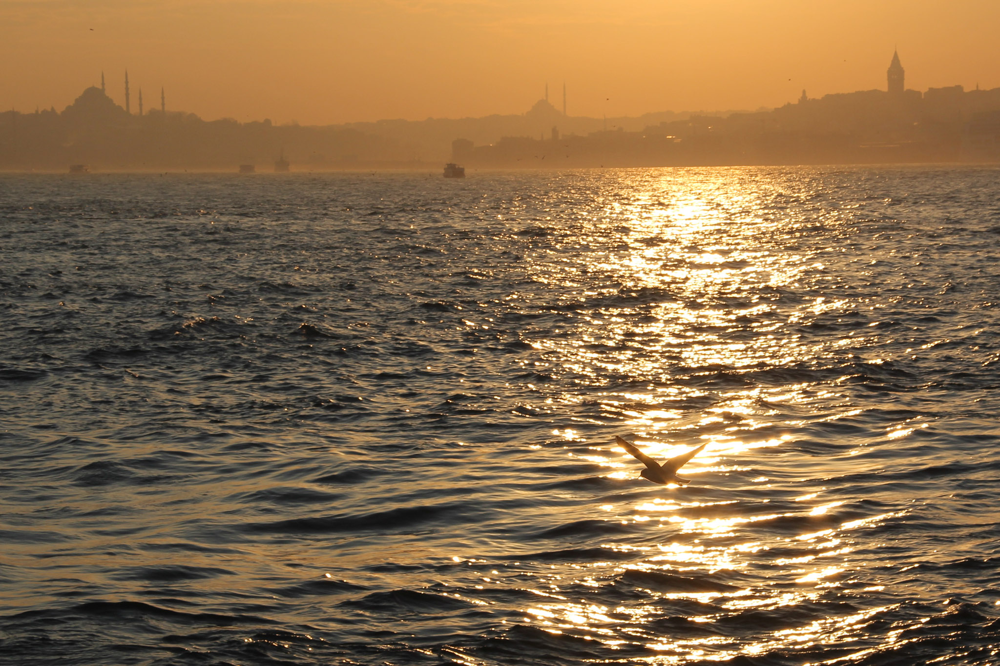
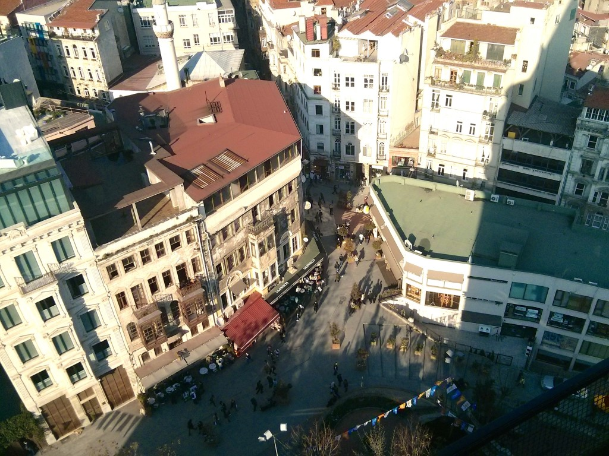
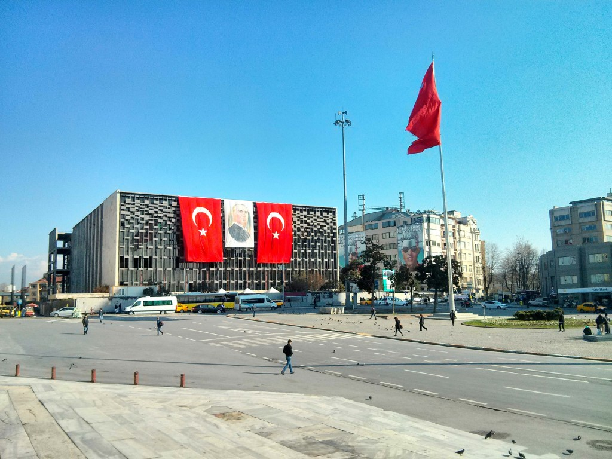
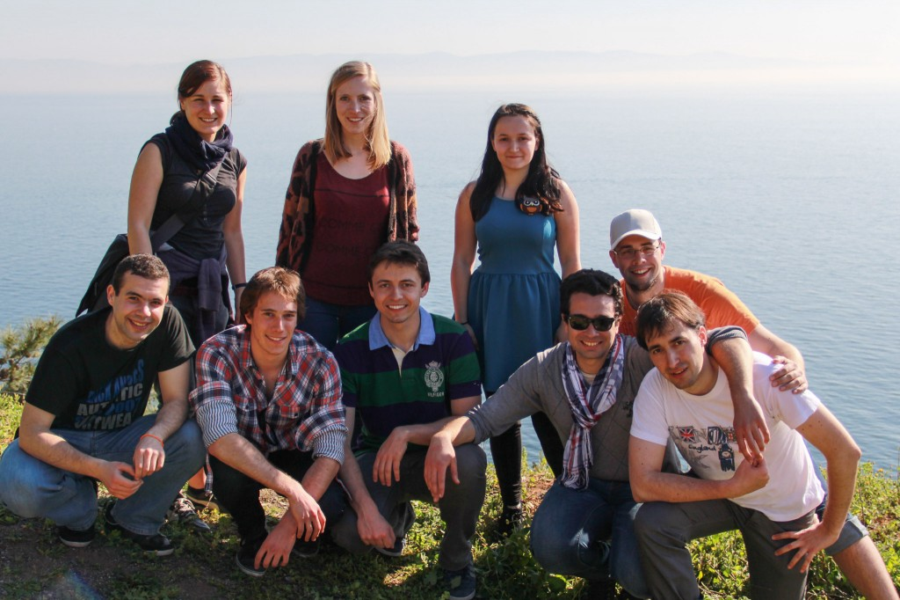
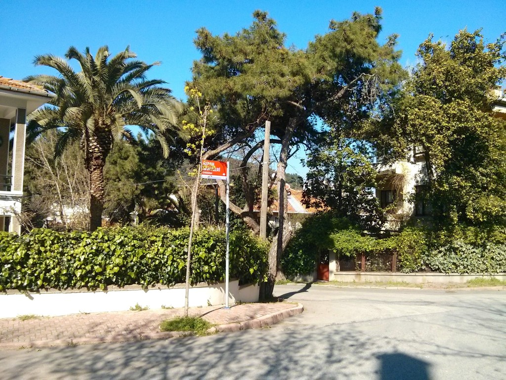
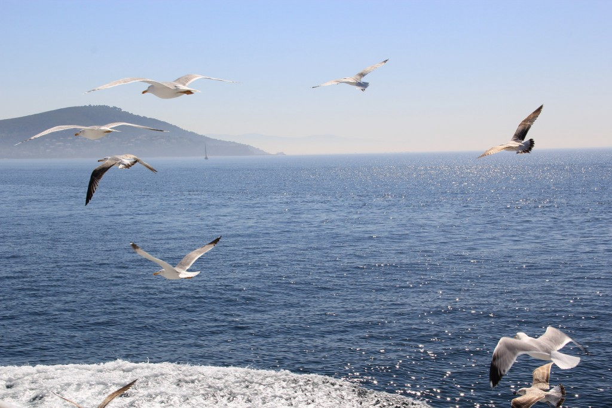
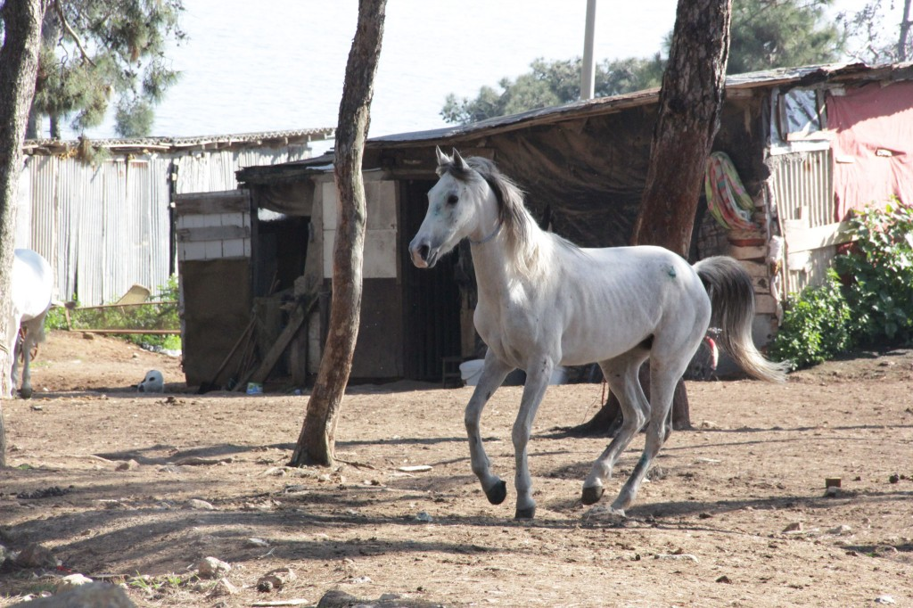
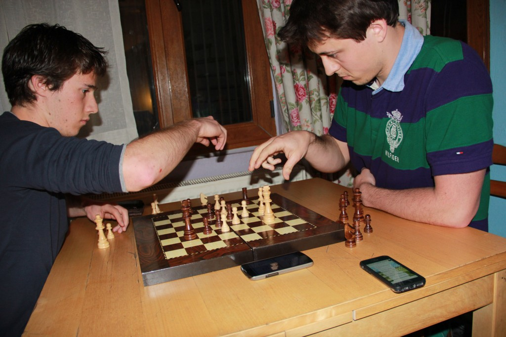

Minulý týden jsem se zúčastnil výměnného programu [ATHENS](http://www.athensprogramme.com/) v jehož rámci jsem vyrazil na 9 dní do úžasného Istanbulu.  Turecko ve mně zanechalo natolik silný dojem, že se o něj musím podělit prostřednictvím blogu. Takže si dojděte pro večeři a pohodlně se usaďte, protože to bude delší počtení. 

## Co je to ATHENS?

Je to evropský program organizovaný univerzitou v Paříži  - ParisTechem. Celá akce trvá 1 týden, účastní se jí několik desítek evropských škol (včetně i jedné české - ČVUT) a tisíce jejich studentů. Účastníci tohoto týdne si nakoupí letenky a zahrají si monstrózní škatulata hejbejte se. Na zahraniční univerzitě na ně čeká 5 denní intenzivní kurz na vybrané téma (typicky technické), završené testem a diplomem o jeho absolvování. Avšak bylo by velmi smutné strávit týden v zahraničí pouhým sezením ve školní lavici, a proto si pro vás škola nachystá i bohaté kulturní vyžití. 

## Pěkné, ale kolik to stojí?

Tohle je asi nejlepší část na ATHENS. Pro studenty ČVUT je to téměř za hubičku, jelikož nám škola platí jak letenku, tak i většinu nákladů na bydlení a jídlo. Na ATHENS můžete však jet pouze jednou, takže je potřeba pečlivě vybírat. 

## Kam teda jet?

V nabídce jsou povětšinou západní města jako Paříž, Vídeň, Mnichov, Delft, Madrid či Miláno. Mě v seznamu zaujalo ale jedno speciální, nejvzdálenější a na naše poměry nejexotičtější místo - turecký Istanbul. Říkal jsem si, že do Paříže se můžu podívat kdykoliv, ale prožít 9 dní v tomto starobylém a ohromném městě na hranici Evropy a Asie se mi už jentak nepoštěstí. 

## Vybráno a co dál?

Ano přiznávám, nevybíral jsem si podle náplně kurzu, ale cílové destinace. Na Istanbulské technické univerzitě (ITU) byl kurz otevřený pouze jeden a to sice týkající se GPS. ITU jsem si tedy dal bez váhání na první místo. Celý přihlašovací proces je velmi jednoduchý a rychlý (chtějí jen pár základních údajů, žádné doporučující či motivační dopisy). Stačí sledovat stránky ČVUT, registrace na ATHENS jsou 2x ročně, přihlášku je potřeba si nechat potvrdit na studijním a to je vlastně vše. Pak už jen čekáte, co vám přidělí. 

## Istanbul!

Na kurz ITU se přihlásilo 40 lidí a 20 jich přijali. Tenhle pěkný flip jsem vyhrál, koupil si zpáteční přímou letenku Praha-Istanbul (za 8000Kč) a došel si na rektorát pro pěkných 11 200Kč. Jak s penězi naložím, už bylo na mě. 

## Před odletem

Před odjezdem jsem tradičně nic neplánoval, nestudoval a pouze potvrdil rezervaci v hostelu, který nám škola vybrala. O Turecku jsem prakticky nevěděl ani fň. Udělal jsem si akorát screenshot z Google Maps s cestou ze zastávky busu na hostel. Turecko není v EU a tudíž roaming je za drakonické ceny (250Kč za 1MB dat a podobné pecky). 

## Letadlo

Letěl jsem s Turkish Airlines, které jediné provozují přímý let Praha-Istanbul. Protože škola proplácela letenku až do výše 7000Kč, sáhnul jsem po této pohodlné variantě. S přestupem a pochybnými východoevropskými společnostmi by se dalo letět i za 5000Kč. Za poslední rok a půl jsem letěl cca 20x a Turkish Airlines jsou zdaleka to nejlepší, co jsem zatím zažil. Nejlepší obsluha, orientální hudba, perfektní turecké jídlo, pravé příbory a talíře místo plastových hraček. Let trval necelé 3 hodiny. 

## První výzva

Věděl jsem, že z letiště mám jet autobusem na Taksim. Očekával jsem, že se mě před východem z letiště bude snažit každý nacpat do nějaké předražené pasti na turisty a to se také potvrdilo. První problém, v Turecku skoro nikdo nemluví anglicky. Druhý problém, Taxi a Taksim zní velmi, velmi podobně.  Nakonec jsem se zorientoval díky jiným zahraničním turistům a mohl si vychutnávat za 10 lir (1 lira = 9kč) cestu do víru megaměsta. 

## První dojem

Istanbul je velké velké město. Dle všech žebříčků patří mezi TOP10 na světě a díky minimálnímu výskytu mrakodrapů je neuvěřitelně rozlehlé. Je také ohromně staré a podle toho vypadají silnice a ulice. Myslíte si, že Praha má moc úzké uličky a špatnou dopravní situaci? Istanbul má údajně 2. nejhorší dopravu na světě a to se projevuje tak, že vždy popojíždíte v koloně. Je jedno jestli jedete z města nebo do města. Jestli je pondělí ráno nebo neděle. VŽDY stojíte až popojíždíte v koloně. Město na evropana také hned zapůsobí svojí architekturou, odlišností a špínou. 

## Najít hostel

Po vysednutí na Taksimu začala druhá výzva a to sice najít v té neskutečné změti uliček můj hostel. Když to shrnu, 10 minutová cesta se proměnila v 40 minutové zoufalé hledání. Asi nemusím zmiňovat, jak fajn je za sebou vláčet kufr na kolečkách po kostkách a být tak slyšen na kilometr do všech směrů. Má zoufalost zašla tak daleko, že jsem se začal ptát místních a poprvé v životě jsem začal naplno spoléhat na nejrozšířenější světový jazyk "rukama a nahoma". 

## Na místě

Při bloudění jsem měl poprvé v životě pocit, že tady skutečně přestává legrace. O to větší radost byla, když jsem svůj hostel konečně našel (po té, co jsem kolem něj před tím asi 5x suveréně prošel) a zhluboka si oddechl. Škola pro nás zarezervovala [Chillout Cengo Hostel](http://www.cengohostelistanbul.com/) za 10EUR na noc. V celku parádní cena za místo v úplném centru Istanbulu. Samotné bydlení bylo však trochu punkové. Pokoj pro 8 lidí, 2 koupelničky pro 20 lidí a zbytek společný pro všechny.  Ale byla tam wifi, takže dobré. 

## Kdo jsou ostatní?

Výhodou ITU je to, že organizuje jen 1 kurz a naše skupina byla tak dost kompaktní (nakonec 17 lidí). Skládala se z 5 Franzouzů, 3 Němců, 3 Nizozemců, 2 Rakušáků, Itala, Španěla, Nora a mě. Juchů, žádní Češi, procvičím si o to lépe angličtinu, říkal jsem si. Ve skutečnosti jsem si spíš prosvištěl němčinu a protrpěl francouzské syčení.  Hned od příjezdu se nás ujaly 2 holčiny z ITU ESN a šli jsme na první večeři, pregame a party (to se pak opakovalo v podstatě každý den). Organizace velmi slušná. 

## Památky

Hned v neděli pro nás škola objednala povinnou tour s průvodcem. Vozili nás autobusem sem a tam, pak i lodí, byli jsme na obědě i večeři a vyplázli za to neskutečných 50EUR. Jednoznačně palec dolů. Ke všemu bylo ještě pěkně hnusné počasí (jediný sichravý den za celý pobyt).

## Škola

A v pondělí hurá do školy na kurz. V Istanbulu funguje celkem slušná síť metra, tramvají a autobusů, které jsme pro dopravu často využívali. Jedna cesta stála s Istanbul kartou 2 liry. Samotná škola je několik stanic metrem od Taksimu, nacházela se v obrovském uzavřeném kampusu a vypadala hodně dobře. Samotný kurz byl velmi snadný a úspěšně ho dokončil i angličtinou nepoznamenaný Španěl, který přišel pozdě i na závěrečný test. Nic jsem od kurzu nečekal a přesně to jsem i dostal. V pátek nám dokonce dali úplné volno, takže jsme ve třídě z toho týdne proseděli tak 10h.

## Jídlo

Tak a teď se můžu už věnovat těm zábavnějším věcem. Co mě nadchlo asi nejvíce, je jídlo. Turecká kuchyně je fantastická, levná a pestrá. Základem je kebap na 1000 způsobů točící se kužel masa najdete na každém rohu), kofte (masové koule), ryby, rýže, brambory, spousta netradičního ovoce a zeleniny, mléčné drinky (podobné indickému lassi), selap (horké mléko s medem, vanilkou a skořičí) a i spousta sladkých specialit jako baklava či lokum. A to vše za poloviční ceny co u nás. Rozhodně jsme tedy hlady nestrádali. Za zmínku také stojí čaj, který bývá téměř všude a často i zadarmo.

## Lidé
Zprvu prožijete celkem značný kulturní šok. Turci jsou velmi temperamentní, ukřičení, přímí a takoví živí. Rychle si na to zvyknete a doma vám bude pak vše připadat hrozně nudné a tiché. I přesto, že jsem většinu času strávil s ostatními atheňáky a přes velkou jazykovou bariéru (obojí nemám ani trochu rád), tak se našel čas i na popovídání s domorodci. A byli překvapivě velmi otevření. Dozvěděl jsem se i o té odvrácené stránce Turecka a je bohužel velmi temná. V zemi nefunguje demokracie, vládnoucí strana utahuje šrouby už 12 let a na demonstrace neváhá použít hrubou sílu, při které pravidelně umírají lidé včetně dětí. Posledním výkřikem bylo úplné zablokovaní Twitteru, který Turci intenzivně používají a přes který se šířily informace o neuvěřitelné korupci vládnoucí strany. Za 5 dní je čekají lokální volby a už teď je jasné, že ulicemi opět poteče krev. Nicméně domorodec dodal, že věří v světlé zítřky, tak aspoň něco.

## A více památek

Istanbul je město s bohatou historií, kde se tisíce let míchá křesťanství (Evropa) a islám (Asie), kde bylo sídlo Osmanské i Byzantské říše. Není tedy nouze o místa k vidění. Nebudu tu vypisovat všechna místa, která jsme viděli, ale zmíním jen 3 věci, které je opravdu potřeba navštívit.

1. Topkapi palace sídlo sultána Osmanské říše. Platí se tam sice nehorázné vstupné (50 lir), ale určitě nechcete přijít o návštěvu sultánovy ložnice a jeho slavného Harému. Poblíž jsou pak i proslulé mešity Blue Mosque a Hagia Sophia a také podzemní Basilica Cistern (starodávná nádrž na vodu).
2. Prince Islands ostrovy vzdálené asi hodinu lodí (v rámci městské hromadné dopravy). Na ostrovech je zajímavé to, že na nich platí úplný zákaz motorových vozidel a tak se po nich prohánějí jenom koně a kola. Ideální způsob, jak na den uniknout rachotu velkoměsta a vychutnat si skvělé počasí.
3. Hamam turecké lázně, aneb tradiční a neuvěřitelný zážitek. Je potřeba však najít nějaké neturistické místo. Nejenže jsou 3x levnější, také tam nikdo nemluví anglicky a o to je celý zážitek více překvapující. Od turků jsme si nechali doporučit tyto a bylo to super! Hamam je tradičně jen od mužů (= staří tlustí chlupatí turkové) pro muže. Nyní však už existují i pro ženy. Za 35 lir na nás čekala hodinová procedura. Začíná se saunou, pak se vás ujme jeden z turků a jakousi rukavicí z vás odrbe všechnu odumřelou kůži, oplachuje vás vodou. Následuje asi 15 minutová brutální masáž, při které to praská a dostáváte jednu facku za druhou. Kupodivu jsem jí přežil bez újmy a dokonce mi od té doby přestalo úplně lupat v pravém ramenu. Nakonec přijde ještě hodně pěny a finální umytí. Pak už dostanete do ruky noviny a čaj.

## Další specifika Turecka

Velmi typické a pro nás nezvyklé je smlouvání. Pokud něco koupíte za plnou cenu (kromě jídla), naletěli jste. Vždy se totiž očekává nějaké smlouvání. Další absurditou je to, že obchody stejného zaměření jsou vždy na stejném místě. Najdete tak ulici plnou motorových pil, kol, koření nebo palačinek. Když pak takovouto ulicí procházíte, její majitelé se překřikují a snaží se vás dostat do jejich obchodu.

## K čemu jsou ATHENS?

Je to tak trochu levná a rychlá varianta Erasmu.  Pokud si nejste jistí, že byste zvládli 5 měsíců v zahraniční, jsou ATHENS ideálním startem. Obecně vidím tyto výměnné programy jako jednu z nejužitečnějších věcí v souvislosti s EU.  A je to vlastně od EU i velmi chytré, pokud má jít Evropa cestou komplexní integrace. Starší generace se asi už nikdy za evropany považovat nebudou. Ovšem ta naše mladší se dá ještě tvarovat. Podpora cestování je myslím velmi silný nástroj. Nejenom, že jsem se za týden dozvěděl spoustu věcí o poměrech v Turecku, ale také i ve Francii, Německu či Itálii. Pomáhá to překonávat jakékoliv bariéry a navozuje to v nás pocit, že je nám celá Evropa maximálně otevřena a připravena stát se naším domovem. A proč ne?

## Naštvanej kůň

Když jsme jezdili na kole po Prince Islands, tak jsme narazili na stádo volně puštěných koní. Souznění s úžasnou přírodou se velmi rychle změnilo v tragikomickou scénku, když naší předsunutou holčičí skupinku začal nahánět rozzuřený kůň. Místo toho, aby holky zachovaly klidnou hlavu, přestali se hýbat a kůň se uklidnil, tak začaly křičet, jako když je na nože berou a ujíždět. K jejich křiku se přidal i kůň a společně si dali svižných 300 metrů. Pak se kůň na ně vykašlal a šel zpátky ke stádu. A jelikož jsme netušili (zbytek výpravy) co jiného dělat, tak jsme jenom brečeli smíchy.

## Prohraná sázka

Jelikož byl v hostelu poměrně bídný internet a nechtěli jsme u toho piva jenom tak sedět, tak jsme vyzkoušeli i klasické turecké společenské hry jako backgammon. A byly tam i šachy. Slovo dalo slovo a někdo se ozval, že je hraje. Hra s náhodným člověkem pro mě znamená většinou celkem snadné vítězství, protože je už roky hraju závodně. O to větší překvapení bylo, že jeden z Francouzů je závodně hraje taky a dokonce máme úplně stejné mezinárodní hodnocení (FIDE ELO). A také to, že hraje celý život dokola úplně stejné zahájení jako já. Tak jsme dali pár oťukávacích blicek a na druhej den naplánovali sázku. Poražený zajistí vítězovi ubytování na víkend v Paříži/Praze a jako bonus ještě flašku dobrého Francouzského/Českého vína. Hráli jsme na 4 vítězné body 5 minutové bleskovky. Bez větších problémů jsem prohrál 4:1. Takový záchvat vzteku jsem měl naposledy někdy před 2 roky, kdy jsem ještě hrával poker. Nicméně i tak se asi do Paříže podívám. Jo a taky jsem od Němců pozván do Mnichova na Oktoberfest.

## Shrnutí

Co si z téhle změti informací odnést? Pokud jste na ČVUT, přihlašte se na příští kolo ATHENS, jinak jste pitomci. Istanbul je nejzajímavější a nejúchvatnější město, které jsem kdy v životě navštívil. Jasně, San Francisco nebo New York City stojí také za pozornost, pokud jste ale ze středoevropské kotliny, nenabídnou vám tolik jako Istanbul. Je to kompletně jiná kultura, náboženství, jídlo, architektura, styl života a jazyk. Otevře se vám úplně nový svět a osobně to ve mě vyvolalo velkou chuť cestovat v budoucnu ještě více směrem na východ.
