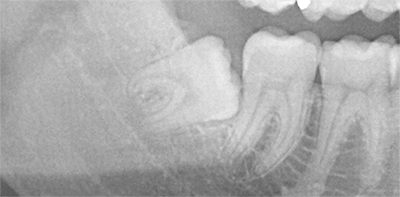

Je krásný letní den. Cítíte se skvěle. Nic vás nebolí. Máte chuť změnit svět. Ovšem za 3 hodiny započne trýznění, které pravděpodobně nemělo ve vašem životě obdoby. Potrvá minimálně 5 dní. Svět se změní v hlučné a otravné panoptikum. Bolest vás udeří tak silně, že nebudete moct usnout. A když usnete, tak se budete ve snu bát probuzení. Léto, slunce a TEPLO - věci které milujete, vás začnou neskutečně srát. **Co se stalo?** Příroda! Rozhodla se nám do těla zabudovat kurvítko. Vložila do nás časovanou bombu. Jedna by však nestačila. Co kdyby selhala? Proto jsme byli obdarováni hned čtyřma. Řeč je o osmičkách - moudrácích - těch zbytečných zubech, o které jsme nikdy nestáli. Nyní trochu informací. Zub moudrosti je 3. stolička, která se většinou prořezává mezi 18. až 24. rokem života.

Když jsme kdysi lezli po stromech a žili v jeskyních, hodila se pro rozmělňování tuhé potravy. Poté však nastoupil oheň. Jídlo začalo být měkké a zbytečně dlouhá čelist se přirozeně zkracovala. Na osmičky tak už nemá dnešní moderní člověk v puse téměř žádné místo. Leckdy jsem měl v životě štěstí. Mé zuby do toho ale bohužel nespadají. Těžko byste v mé třídě hledali dítě, které je mělo víc křivé než já. Dva roky sexy zámečků, drátků a gumiček to však celkem slušně spravily. Mysteriózní tmavě žlutý nádech umocněný pozůstatky lepidla také díru do světa neudělal a tak přišlo na řadu pískování a peroxid. Nu a co se týče kazivosti, tak naštěstí existují pěkné plomby z bílého kompozitu. Když už jsem si v 20 letech říkal, že mám konečně vyhráno, tak se objevil nový nepřítel - zákeřné osmičky. Nejen, že se ty svině sami neprořezaly, oni se dokonce rozhodly růst šikmo a odrovnat i své sousedky. Aby se zabránilo této bezprecedentní agresi, bylo potřeba vyhledat odborné služby chirurga, který ty malé hajzlíky postupně zlikviduje. Už asi před 2 lety přišel na řadu pravý horní. Byl už skoro vidět a na jeho vytrhnutí stačily v podstatě jen kleště. Bolest velmi protivná, otok žádný, hojení rychlé. Málo motivace na to, abych o tom tenkrát napsal článek. 

<figure class="floatLeft">
  
  <figcaption>Hrdinka dnešního článku</figcaption>
</figure>

Dva dni nazpět však přišla na řadu osmička prává dolní - **ta nejkomplikovanější**. Dolní zuby vám dají extrakci daleko více vyžrat než ty horní. Samotný zákrok je úplně bezbolestný, tedy až na první umrtvovací injekci. Po té už jen zavřete oči a zaposloucháte se do slastného zvuku vrtačky/rozbrusky, kterou vám zub během 5 minut rozpůlí. Následně to krásně křupne (ulomení korunky) a kleště dílo dokonají - nejdříve se poroučí korunka a pak první a druhý kořen. Mimochodem, viděli jste už film Hostel? Jelikož vám tím v puse vznikla díra jak do prdele, tak si domů odneste ještě asi 5 mašliček (stehů). **Ta pravá sranda, ale začíná tři hodiny od zákroku**. Krom toho, že začnete opět cítit rty a jazyk, tak se vám hlasitě také ozve dolní čelist. Sdělení má pro vás prosté - ten krvavý mejdan si neužila zdaleka tak jako vy. Četl jsem hodně článků o tom, jaký je ibalgin prevít a vždy jsem vzhlížel k filmovým hrdinům, kteří chlapácky odmítali sedativa, protože je bolest dělala silnějšími.

Shrnu to asi takto: Kdybychom měli v práci lustry, tak bych na jeden ihned vyskočil. Lehčí předávkování růžovým kamarádem bylo nutností. Nebojte, druhý den (dnes) to začalo být ještě lepší. Příroda se rozhodla mi ukázat, jak bych vypadal v obličeji, **kdybych přibral 60kg**. Aby mě od toho ochránila, tak mi zamezila v konzumaci prakticky jakýchkoliv potravin. Tou 2 cm škvírou, kterou dokáži s vypětím všech sil na místě, kde bývala ústa, vytvořit, toho moc prostrčit nelze. A když ano, tak to stejně musíte rovnou spolknout, protože kousání je dočasně "rozbité". Po té, co dojde ke zlepšení, se bude můj příběh opakovat. Ty mrcho tam dole vlevo, seš na řadě! A s tebou, milá přírodo, jsem také neskončil!