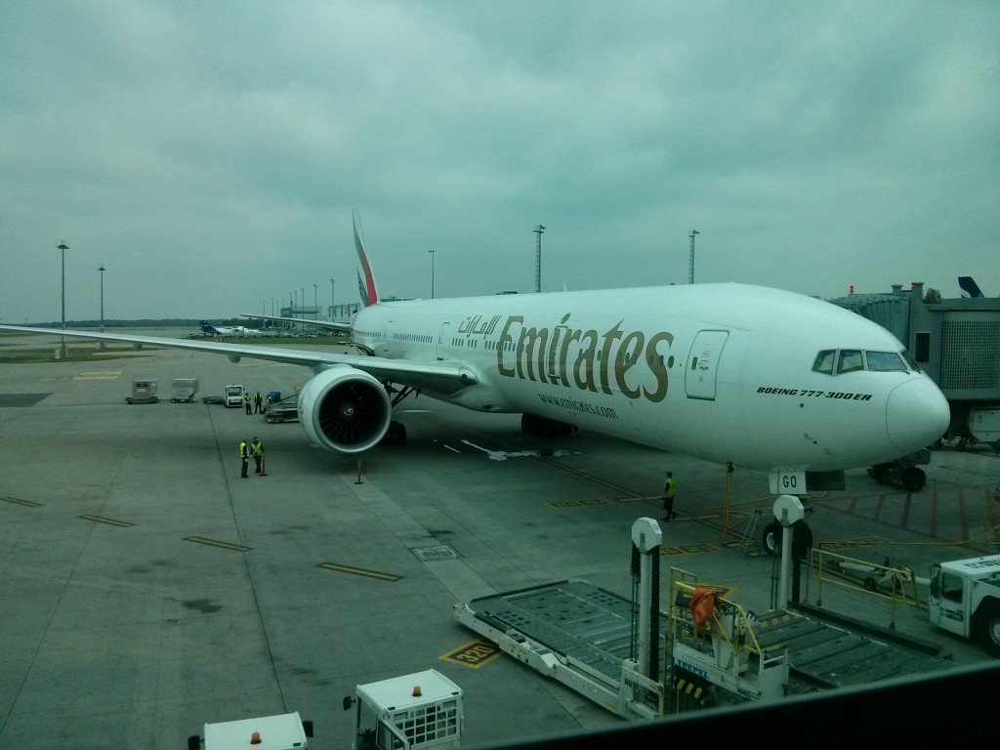

Jak jsem se na Masdar vlastně dostal? Dozvěděl jsem se o něm prostřednictvím ČVUT, které přeposlalo nabídku z MZV. Moje přihláška tedy oficiálně šla přes tyto 2 české instituce. Musíte dodat prakticky stejné dokumenty jako pro americké školy - tedy TOEFL, GRE, motivační dopis a 3 doporučení, což je fajn, protože jsem měl tyto věci už pohromadě. Jak těžké je být Masdarem vybrán? Popravdě, neumím to moc posoudit, jelikož o tom asi nejsou žádné veřejné statistiky. Nicméně škola je to poměrně malá. Má pouze magisterské a doktorské programy, celkem cca 400 studentů. Je téměř výhradně orientovaná na výzkum a výuková činnost je minimální. Studenti jsou nabíráni podle určitých kvót, takže tu typicky najdete z většiny EU zemí 1-5 lidí (z Česka a Slovenska jsem tu však sám).

Obdobně pro asijské a africké země. Samozřejmě je tu také hodně místních a to především dívek (opět nějaká speciální UAE iniciativa). Potkáte tu tedy lidi ze všech kontinentů. Na jednu stranu se institut zaklíná spoluprácí s MIT, na druhou stranu však o kvalitě nekterých místních studentů celkem pochybuji (například TOEFL a GRE požadavky nejsou moc přísné). Řekl bych, že evropani a američani jsou celkově daleko silnější než zbytek studentů. Deadline pro přihlášku je až někdy v dubnu či květnu, což je fajn narozdíl od amerických škol, které mají uzávěrky už někdy v prosinci či lednu. Po oficiálním dopisu o přijetí bylo potřeba oskenovat a dodat pár dokumentů. Škola všechno papírování vyřizuje za vás. Nemusíte tedy oblézat zahraniční ambasády a utrácet peníze za víza. Horší ovšem je, že si s vyřizováním víz dává sakra načas. Byl jsem jeden z těch méně šťastných a dostal ho až 2 týdny po začátku školního roku, což je dost nanic. Občas se stane, že někdo vízum dostane tak pozdě, že nemůže v daném semestru vůbec nastoupit. Ano, zdejší úřady nefungují vůbec spolehlivě.

<figure class="floatLeft">
  
  <figcaption>Letadlo Praha - Dubaj</figcaption>
</figure>

Za zmínku stojí ještě jedna věc. Součástí podkladů pro vízum musí být poslání RTG plic jako důkaz, že nemáte tuberu, negativní HIV test a očkovací průkaz. Není to úplně překvapivé, protože to chce poměrně hodně asijských zemí. Co mě však zarazilo více, že jsem stejné testy musel podstoupit opakovaně i po příletu. RTG plic není zrovna šetrná věc a dostat hned dva během jednoho měsíce nebude asi moc dobré. Samozřejmě jako turisti žádná víza už nepotřebujete a nic z tohoto se vás netýká.

Poté co mi emailem přišlo vízum (entry permit), objednal jsem na druhý den jednosměrnou letenku Praha-Dubaj s Emirates. Stála 13 000Kč (škola proplácí). Let trvá 6 hodin a překoná 2 časová pásma. Nutno podotknout, že Emirates jsou jedna z TOP společností na nebi a podle toho vypadají jejich letadla a obsluha. Bylo to ještě o chlup lepší než má výborná zkušenost s Turkish Airlines. Mimo sezónu je to jediný možný přímý spoj ČR - UAE. Ano, hlavní sezóna je tu přes zimu, jelikož v létě je tu pro většinu lidí nesnetilené vedro. Nyní už lítají na této trase i Smartwings a nově Flydubai. Zpáteční letenka u nich začíná už na pouhých 4400Kč. Vánoce doma mě tedy rozhodně nezruinují. Jaký byl první den v UAE? O tom zas příště.