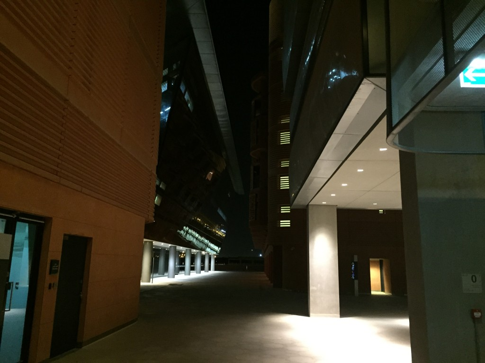
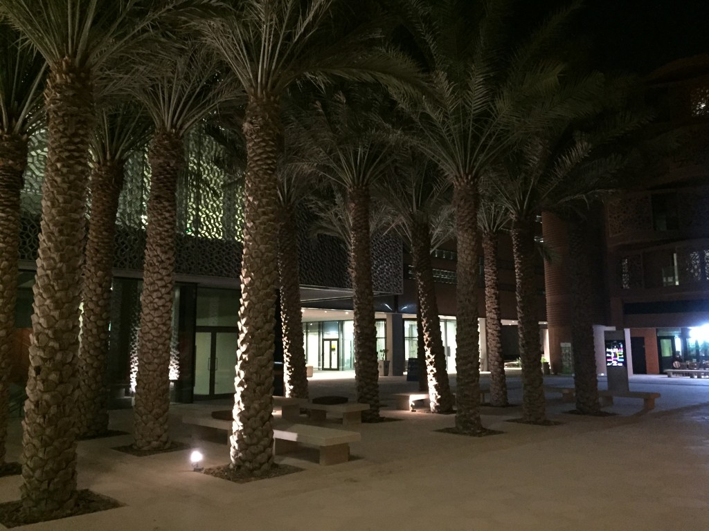
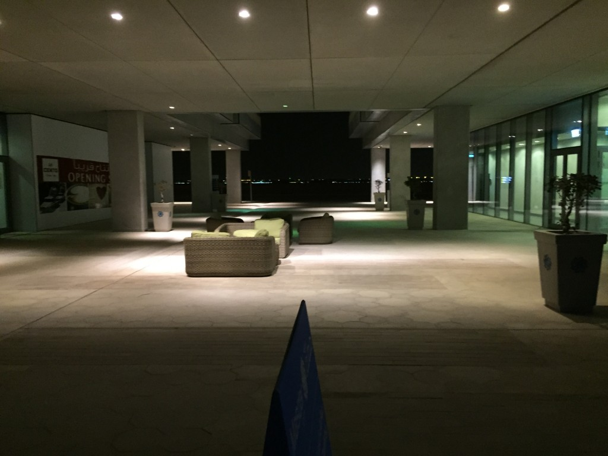

První den, první týden, první měsíc a první rok - základní epochy, během kterých se rapidně mění vaše názory, zvyky a pocity v nové zemi. Paměť nemám kdoví jakou, ale nikdy nezapomenu na to, jak probíhalo prvních 24h v Americe včetně těch nejmenších detailů. Ne jinak to je i s příletem do Spojených arabských emirátů. Stěhování do Ameriky předcházela složitá několika měsíční příprava v podobě různých seznamů, co si s sebou vzít, opakované procházení zkušeností předchůdců, setkání s předešlou skupinou českých studentů, setkání se studentama z MSOE, co byli zrovna v Praze, atp. Úplně zbytečné.

Nestresovat a neplánovat každý krok, toť mini dovednost, kterou jsem se za poslední 2 roky naučil. Rázem udělá jakékoliv cestování/stěhování o 200% příjemnější. Po pohodovém 6h letu jsme dosedli v Dubaji. Pilot jen suše zahlásil: "Vítejte v Dubaji. Je čtvrt na jednu ráno a venkovní teplota je 40°C." Ok. Konečně se trochu ohřeji. Překvapilo mě, že tubus vedoucí od letadla ke gate je pečlivě klimatizovaný. Nakonec, jsou tu klimatizované i zastávky autobusů.

<figure class="floatLeft">
  
  <figcaption>Masdar City v noci</figcaption>
</figure>

Dubajské letiště je obrovské. Terminál 3 (Emirates) je největším terminálem na světě (3. největší budova na světě, co do užitné plochy). Letiště jsou pro UAE naprosto klíčové, jak strategicky i ekonomicky. Nabízejí ohromné množství přímých spojů na všechny světové kontinenty - naprosto ideální výchozí pozice, pokud chcete levně cestovat zároveň do Evropy, Afriky a Asie. Navíc, nejen že je velké, ale očekávaně i velmi luxusní.

V USA razí heslo: Bigger = better. V UAE je to stejné, navíc ještě ale přidávají: More expensive = better. Díky blbuvzdornému značení jsem celkem lehce našel kufr a mohl si to nakráčet ke stanovišti taxíků. Konečně první nadechnutí se emirátského vzduchu. Moc dobře si pamatuji stejný moment v Chicagu. Otevřely se automatické dveře, ze shora příjemně zafoukal proud studeného vzduchu a pak to přišlo. Pořádná ulepená facka. Jak tu sakra může někdo žít? Vždyť se tu dá sotva nadechnout.

<figure class="floatRight">
  
  <figcaption>Sci-fi město budoucnosti</figcaption>
</figure>

V den příletu (a ještě celý týden poté) byly nejenom extrémní teploty (přes den 47°C), ale také i extrémní vlhkost, která běžnou saunu povýší na tureckou páru. Fronta na taxíka zabrala asi 10 minut. Stačilo to na to, abych mohl už ždímat tričko, spoďáry, kalhoty a vysušit telefon (i na něm okamžitě zkondenzovala voda). Fíha. Vzpomněl jsem si na předloňský výlet do Údolí smrti. Řidič taxíku byl moc milý pákistánec Abdul. Problémem bylo, že neměl tušení, co je to Masdar City, natož kde to je. Specialitou zdejších taxíků je to, že zcela zásadně nepoužívají navigaci. To v kombinaci s neexistujícím systémem adres představuje poměrně zásadní problém. Jak to tedy funguje? Musíte udat nějaký nosný bod typu velký obchoďák a zbytek už jedete ve stylu "Go left, go right, go straight, ... that's it." No, alespoň jsou hodně levný (necelých 10Kč/km).

Protože benzín 10kč/l... oh yeah. Popravdě s tím, že taxikář bude více v šoku ze mě, než já z něho, jsem vůbec nepočítal. Neměl jsem tedy s sebou ani žádnou mapu a telefon mi byl bez dat také k ničemu. Nu což, řekl jsem mu, že je to poblíž letiště v Abu Dhabi a dali jsme se na cestu. Během ní se mě asi ještě 10x zeptal, jestli je to Masdar City nebo Masdar City (lehce jiná výslovnost), nevzrušeně jsem mu pokaždé odvětil, že Masdar City a v duchu si říkal, že tohle bude dlouhá noc. Pořád někomu volal a snažil se asi zjistit, kam to vlastně jedeme. To vyvrcholilo až v to, že to zadupnul na dálnici mezi Dubají a Abu Dhabi v odstavném pruhu, což mě trochu znejistilo. Po 2 minutách za námi zastavil další taxík. Oba pánové vylezli a začali se dohadovat, kde že ten Masdar asi je. Asi úspěšně.

<figure class="floatLeft">
  
  <figcaption>Všude spousta venkovních křesel</figcaption>
</figure>

Cestu nám zpříjemnil ještě pěkný meterologický jev. Udělala se brutální mlha a po okénkách nám stékaly proudy vody. Viditelnost byla tak na 20m a několik kilometrů jsme tudíž jeli třicítkou. Poblíž Abu Dhabi letiště se objevilo Masdar City na jedné ze směrových cedulí, což bylo dobré znamení toho, že to snad nebude až taková díra. Pořád se mě ptal na každou zatáčku ignorujíc to, že jsem mu asi 20x řekl, že jsem v UAE poprvé. Nakonec jsem přistoupil na jeho hru a začal jsem levou/pravou střílet od boku, tak jak jsem to zrovna cítil (z mapy jsem si toho opravdu moc nezapamatoval). Tyhle příběhy mívají šťastné konce a i my jsme nakonec dorazili do cílové destinace. V Masdaru se mě hned ujal člověk ze security, dal mi welcome pack s mapou, sušenkou a vodou a zavedl mě na pokoj. Jelikož bylo už něco kolem druhé hodiny ráno, šel jsem rovnou spát.
