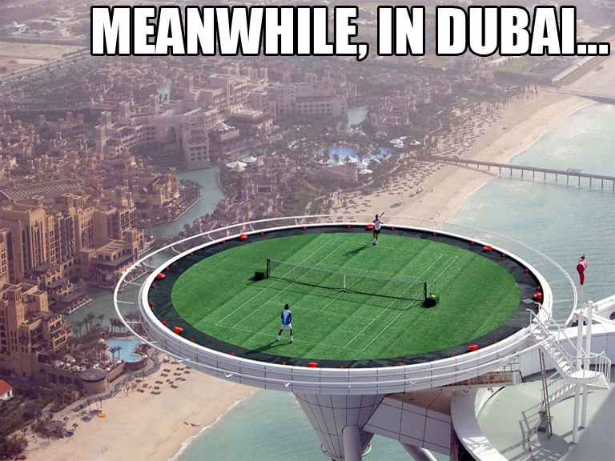
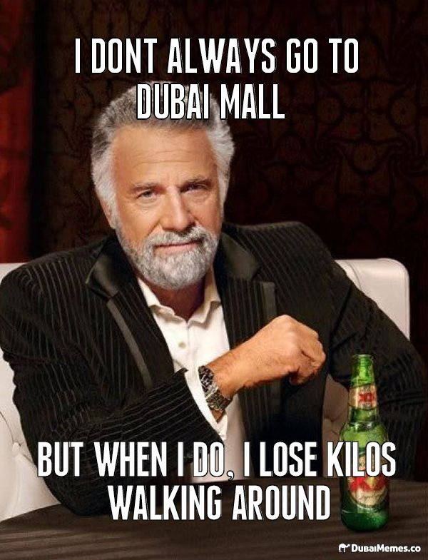

Co si vybavím, když se řekne například Německo? Auta, pivo a bratwurst. Možných odpovědí jsou spousty. Ale co když se mě někdo zeptá na **Spojené arabské emiráty** (UAE)? Islám? Poušť? Ale kdeže. Za mě to jsou jednoznačně peníze. **Ropné peníze**. Po 3 týdenní dovolené doma v Česku jsem nabyl dojmu, že si spousta kamarádů myslí, že v UAE lidé běhají celý den po poušti, v ruce kalashnikov, na hlavě ručník a křičí: "Allahu akbar". Ostatně takový obrázek je nám z blízkého východu  servírován médii poměrně často. Nicméně Arabský poloostrov a speciálně UAE jsou úplně jiným světem.

A prosím **neplést se sousední Saudskou arábií**. Ve srovnání jde o Jižní a Severní koreu. S tím rozdílem, že Saudská arábie má alespoň ty peníze (ropu). Jinak je to však jeden z **nejbarbarštějších** a zavržení hodných režimů na světě, který je bohužel stále tiše tolerován a přehlížen. 

<figure class="floatLeft">
  
</figure>

**Základní fakta**. UAE denně pošlou do světa kolem 3mil barelů ropy, což mohou vesele dělat ještě minimálně dalších 93 let. Pokud počítáme $50 za barel, dostaneme se na nějakých **$54,7 miliard ročně**, což je asi 1258 miliard korun. A to je asi o 200 miliard **více než český státní rozpočet** pro rok 2014. Jasně, jsou v tom rozhodně i náklady na těžbu, zpracování a transport, nicméně pořád jsou to ohromné peníze, které každý rok přijdou na účet UAE tak nějak navíc, že. Navíc srovnání nekončí. **UAE je stejně velká země jako Česká republika**. Nicméně má jen 8 miliónu obyvatel a z toho jsou **pouze 13% místní** a původní emirátčani. Zbytek lidí jsou imigranti, kteří sem přišli až v posledních letech.

Co z toho všeho plyne? **UAE je nesmírně bohatá země**. Možná ne kulturně, historií či přírodou ale rozhodně v dolarech. Tedy přesnější by bylo uvádět, že v UAE žije nesmírně bohatá královská rodina, která tomu tady pevnou rukou vládne. Nicméně i běžní emirátčani měli štěstí v tom, že jejich král pochopil, že si peníze do hrobu nevezme a relativně rozumně je rozdává a investuje. I když o tom rozumně by se dalo asi dost debatovat, což není samozřejmě úplně dovolené. Aneb darovanému koni na zuby nekoukej, ne?

<figure class="floatRight">
  
</figure>

Co se stane, když "povolíte šrouby" a z občanů (zdaleka ne obyvatel ale!) své země uděláte do jednoho milionáře? Vznikne tak trochu **absurdistán**. To je to slovo, které vám přijde občas na mysl, než si tady na to všechno zvyknete. Tak například UAE je asi **nejvíce konzumní společností na světě**. Množství a velikost nákupních center je věc, kterou nedokážu ani po půl roce pořád pochopit. Jsou v nich kluziště, zimní sjezdovky, zoo, podvodní světy, skate parky, lunaparky, restaurace, fast foody, kavárny, obří supermarkety... a samozřejmě stovky a tisíce obchodů se vším, co se na světě vyrábí. **Lidé tam v podstatě žijí**.

Pomáhá tomu také zdejší počasí, které si především v létě říká o pobyt ve velkých klimatizovaných prostorách. A to je jen špička ledovce. **Megalománie**, rozhazovačnost, nulová pokora k přírodě a zdrojům, novodobé otroctví, ztráta motivace ... atd. Nechci si to ale teď hned vše vystřílet, protože právě tohle je to, čím je UAE naprosto typické a co si v budoucnu zaslouží ještě mnoho dalších článků.
