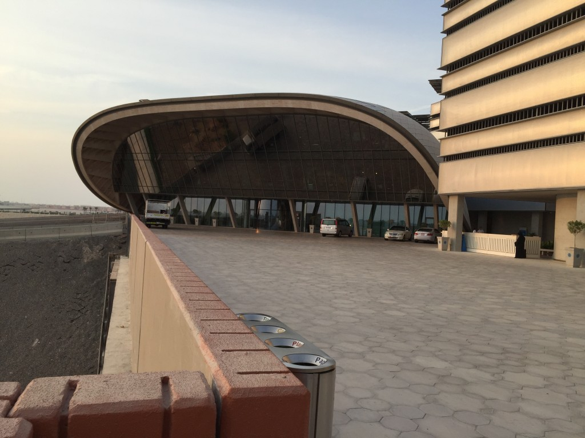
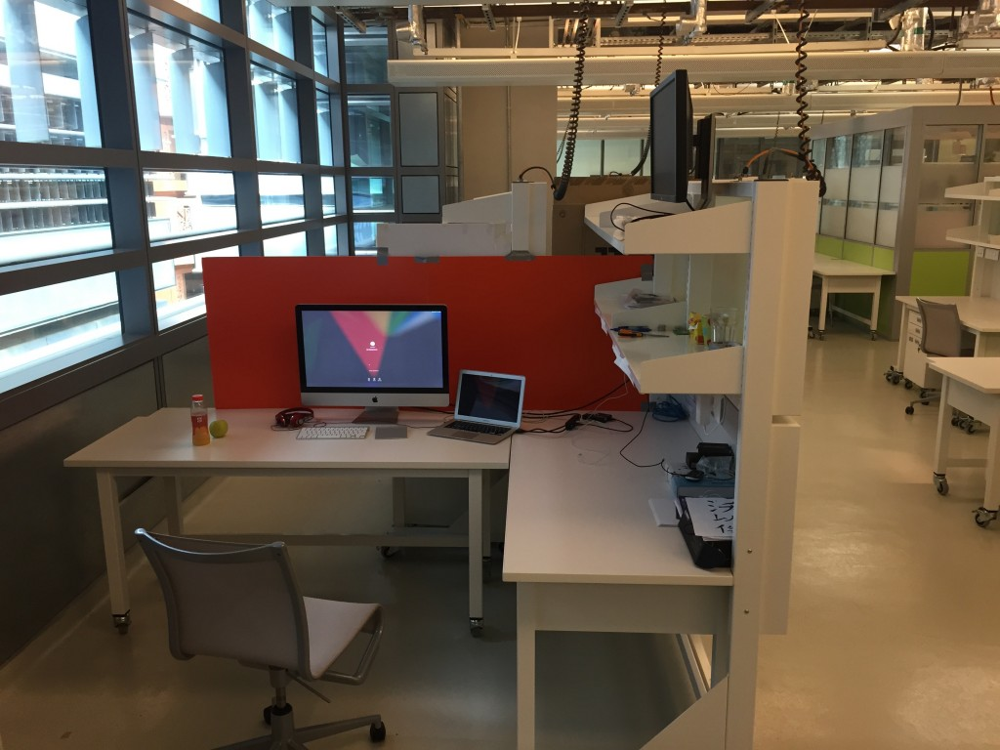
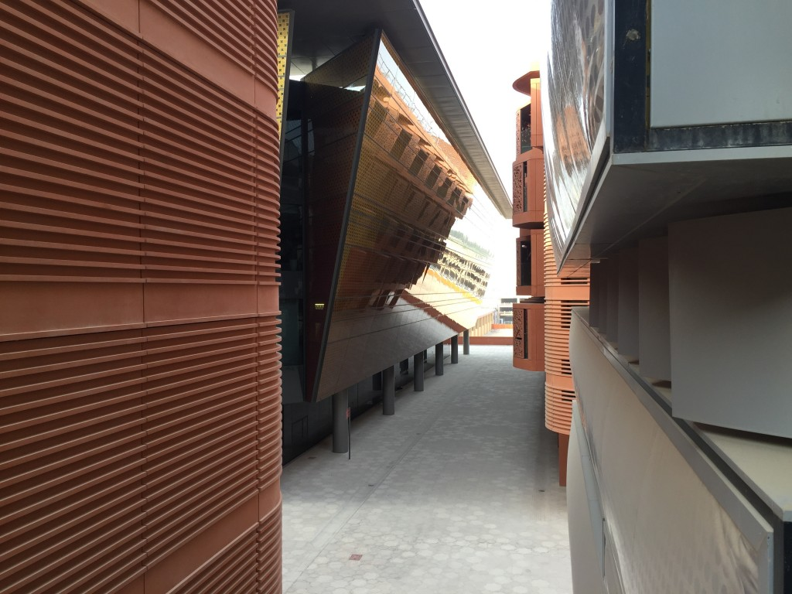
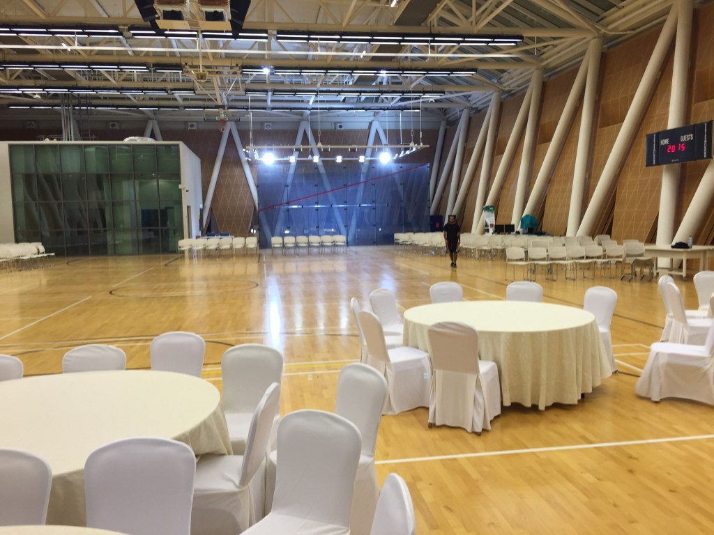

Nejvhodnější odpověď na tuto otázku hledám už od chvíle, co jsem do UAE přijel. Ze začátku to bylo prosté. Stačilo pouze zmínit **nesnesitelné vedro** a že na hlubší analýzu to chce více času a vyčkat do zimy. Nicméně už uběhl skoro rok a to žádá lepší zhodnocení. 

<figure class="floatLeft">
  
</figure>

Finančně a zázemím nešáhá ČVUT či MSOE Masdaru ani po kotníky. Každý tu máme **vlastní** moderní **byteček** s dotykovými obrazovkami, čidly na pohyb, klimatizací či kabelovkou. Každý měsíc dostáváme slušné **stipendium**. Proplácí nám **letenky** domů. Máme luxusní laboratoře, ve kterých máme každý své pracovní místo. Chcete k němu iMaca? Není problém. Žijeme v Masdar City, které je oslavou moderní funkční architektury a plné technologií, která začnou ostatní města teprve používat. Vždyť pod náma tu dokonce jezdí autonomní elektrická autíčka. UAE jednoduše má peníze a nebojí se je použít.

<figure class="floatRight">
  
</figure>

**Dalším kritériem je úroveň školy**. I zde jsou peníze klíčem. Masdar sype spousty peněz **MIT** a ta nám sem na oplátku posílá své profesory a doktorandy. Je tu tudíž spousta opravdu chytrých lidí. Ovšem v mém případě a oboru to trochu skřípe. Computer Science (CS) je tak trochu mimo zdejší hlavní proud. Masdar Institute je především mecca obnovitelných zdrojů, čištění vody, zpracování odpadů či stavitelství. Pokud chcete studovat něco podobného, nenajdete pravděpodobně mnoho lepších alternativ. U CS je to ale naopak. 

<figure class="floatLeft">
  
</figure>

Dobrý CS program najdete prakticky kdekoliv a život v super ekologickém a high-tech městě vás sice může hřát u srdce, ale na váš výzkum nebude mít moc vliv. Ovšem pak je tu ještě jedna věc. **Mimoškolní aktivity**. Když jsem [hodnotil ČVUT](http://blog.miksu.cz/co-mi-dalo-cvut/), tak jsem to označil jako to nejdůležitější. A tady bohužel Masdar propadá na celé čáře. Nedá se říct, že by tu byl nějaký vyložený průser. Spíš je to taková sada drobnějších problémů a parametrů, které se nasčítají a výsledek pak není nejlepší. 

  1. Masdar City je **uprostřed pouště** (absolutní závislot na taxi, autu či školním shuttle busu).
  2. Masdar City = Masdar Institute o asi **500 lidech**, Siemens kanceláře, GE kanceláře, 5 restaurací/kaváren, kantýna, minimarket (bez čerstvého pečiva, ovoce, zeleniny a masa), banka, pošta, tělocvična s posilovnou. Velikostí (zástavby) odpovídá asi 10 fotbalovým hříštím. Další rozvoj probíhá pomalu.
  3. Škola nemá funkční studentskou samosprávu. **Neexistují** v ní **procesy**, natož ty demokratické.
  4. Ve všem je tak trochu **binec**, všechno je pozdě. **Neefiktivita**.
  5. Škola nemá bakalářský program.
  6. Studenti jsou z půlky místní emirátčani, kteří se téměř nikdy neúčastní žádných klubů, sportů či výletů.
  7. Nejsou tu skoro žádné funkční **kluby** či **sportovní týmy**.
  8. Pokud se pokusíte nějaký klub založit, tak vám škola bude spíš házet klacky pod nohy (i tak jsem tu rozběhnul volejbalový tým včetně trenéra, vybavení a odehrání meziuniversitní ligy).
  9. Místní se baví hlavně s místníma. Afričani s Afričanama. Evropané s Evropanama. Nikdo se pak nebaví s těma stovkama Indů a Pákistánců, kteří tu kolem všech poskakují, všechno uklízejí, stavějí a opravují. Časem si na to natolik zvyknete, že už to ani nevnímáte, což je trochu smutné.
  10. Studentů z Evropy je tu tak 40.
  11. Častá **diskriminace** a nerovné podmínky.

Pokud vám jde hlavně o finance a vzdělání, tak není Masdar vůbec špatná volba. Obzvlášť některé obory a jejich garantni jsou opravdu špičkové. Studentský život si Masdar bohužel za rámeček dát nemůže. Na druhou stranu je potřeba být fér a uvědomit si, že škola je stará pár let. Ostatně **před 50 lety tu byl místo Dubaje a Abu Dhabi jen písek a pár chatrčí**. Je docela impozantní co tu dokázali za posledních 20 letech všechno vybudovat. Myslím, že za dalších 20 let to tu už ani nepoznám. Navíc navštívil jsem i ostatní univerzity v Abu Dhabi a je vidět, že to jde, když se chce.

<figure class="floatRight">
  
</figure>

**Roku v UAE vůbec nelituji**. Spoustu kontaktů a kamarádů najdete všude, ale nikde jinde na světě nebudete mít možnost žít v natolik **diverzifikované společnosti**. Kdykoliv dáte dohromady náhodnou skupinku 20 lidí a necháte je se představit, tak máte výpravu, za kterou by se nemusela stydět ani OSN. To, co jsem měl rád na Americe (mix lidí z různých kultur), je tu dotaženo do úplného extrému. Jsou tu zastoupeni opravdu všichni. Vždycky je tak o čem se bavit, porovnávat a hádat. **Dělat si srandu ze stereotypů**. Naučit se respektovat a tolerovat ostatní kultury a náboženství. Na tom je ostatně potřeba pracovat celý život, protože vyrůstáme plní předsudků a fóbií z neznámého. Myslím, že nikde jinde na světě nemůže vyrůst tolerantnější člověk než zde, protože všichni jsou tu minoritou. **Jaký je tedy Masdar?** Pokud je pro vás výzkum na prvním místě a zázemí, které vám v něm pomůže na tom druhém, tak je super. Pokud si ale chcete ještě užít studentský život a nejste proaktivní, tak se poohlédněte raději jinde. Mimochodem, do konce května si můžete [podat přihlášku](https://www.masdar.ac.ae/admissions).
