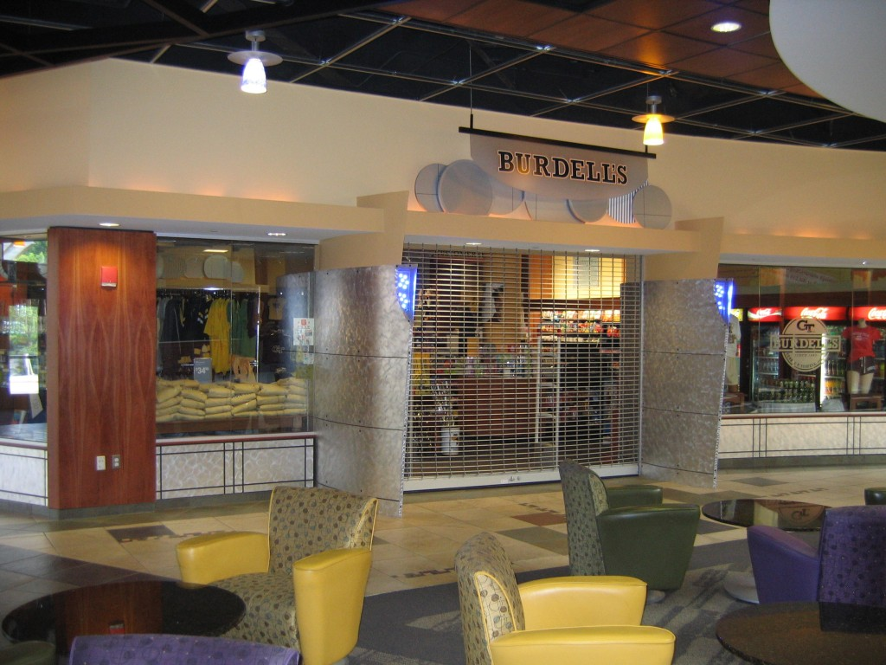

**Jednou z nejlepších věcí na amerických školách jsou jejich tradice.** Každá jich má hned několik a ani Georgia Tech není vyjímkou. Možná tou nejzajímavější je mysteriózní **George P. Burdell**. Jde o fiktivního studenta, který vzniknul už v roce 1927 jako vcelku povedený vtip. Od té doby vystudoval všechny bakalářské programy Georgia Techu, sloužil v armádě, oženil se a málem se stal i osobností roku Time magazínu (byl ale diskvalifikován přestože vedl hlasování). 

<figure class="floatLeft">
  
  <figcaption>GPB má dnes v kampusu i vlastní obchod</figcaption>
</figure>

Jak vznikl? Jeden student dostal omylem dva formuláře pro zápis a napadlo ho tak vytvořit fiktivního studenta. Za něj pak odevzdával všechny úkoly a psal i testy. Škola na to nepřišla a tak v roce 1930 získal GPB svůj první VŠ titul. 

**A to odstartovalo další sérii pranků.** Párkrát objednal náklaďák nábytku jednomu z bratrstev. Nebo se oficiálně zúčastnil několika výsadků na západní frontě během druhé světové války. Po válce mu začali těžké časy, jelikož v roce 1967 přešel Georgia Tech na počítačové systémy. 

<figure class="floatRight">
  <iframe width="420" height="315" src="https://www.youtube.com/embed/6JnnYymMs1I?t=2m29s" frameborder="0" allowfullscreen></iframe>
</figure>

Ovšem ty byly tenkrát velmi děravé a tak GPB opakovaně odstudoval 3000 kreditů za semester. Stal se z něho takový virus, se kterým škola marně bojovala celé dekády. Dnes je oslavován jako jeden z nejvýznamějších absolventů Georgia Techu a jeho jméno se pravidelně objevuje tam, kde dotyčný chce zůstat anonymní. **V březnu navštívil Georgia Tech prezident Barrack Obama a hádejte, kdo ho měl uvést na pódium?**