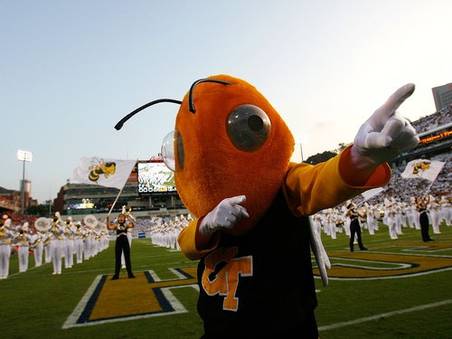
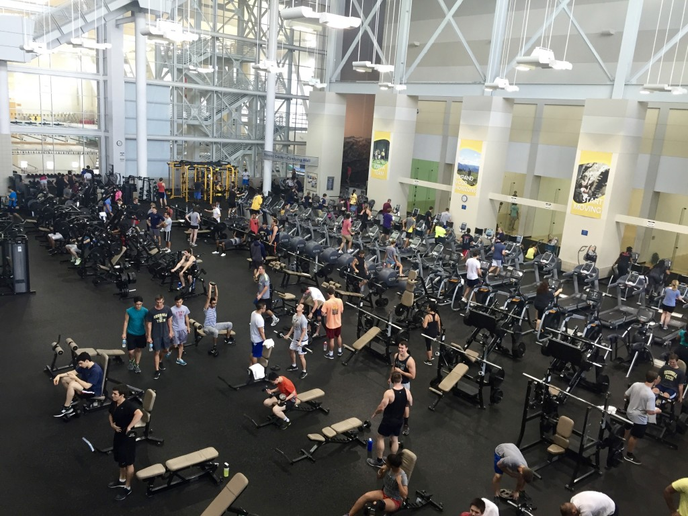
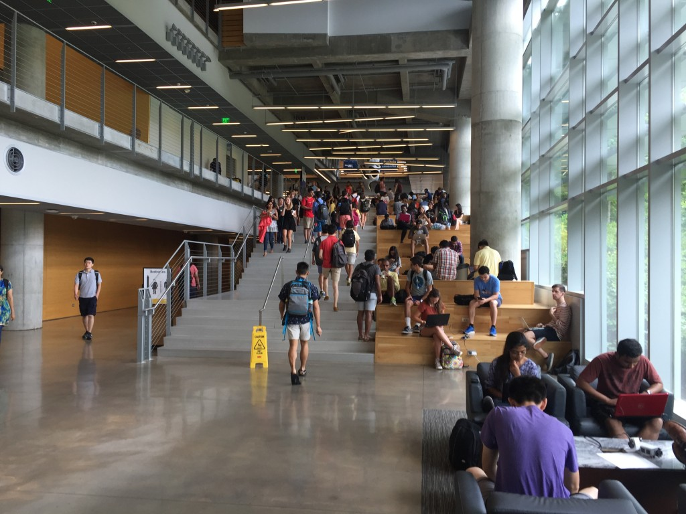
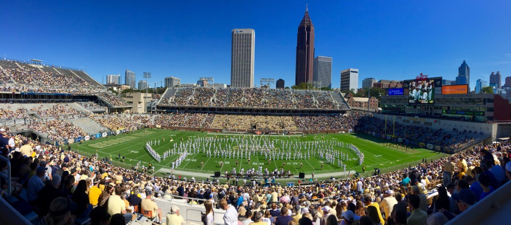
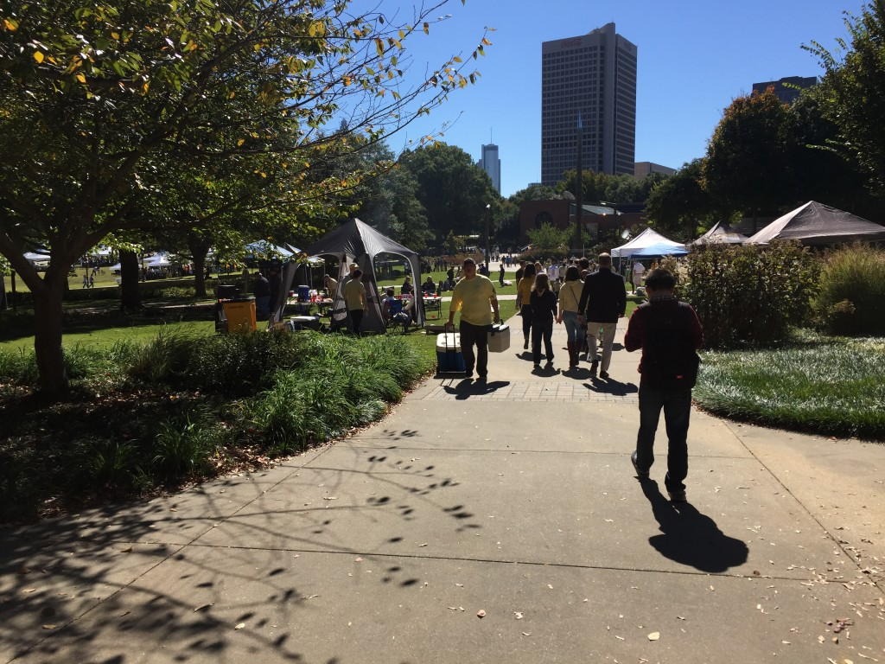
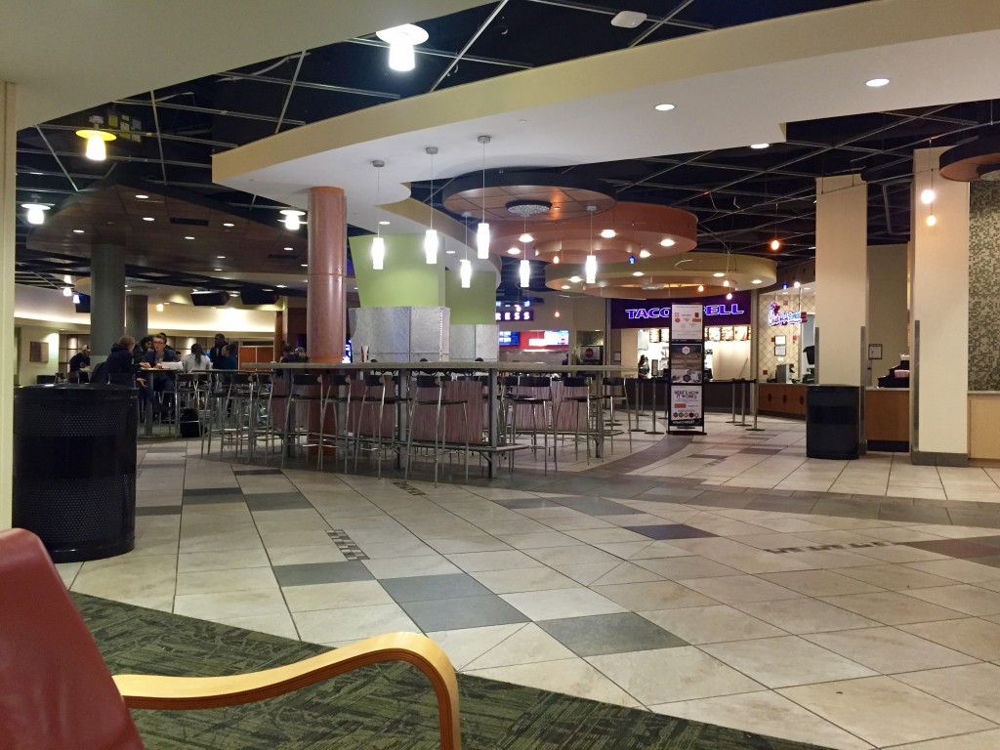

**První semester je vždycky nejtěžší**. Každá škola má úplně jiný rytmus. Do toho se přidává i kompletně nové prostředí, které je v případě Techu a Atlanty natolik bohaté, že bývá problém nezapomínat na samotné studium. Vždy však platí jedno: Pokud se probijete prvním semestrem, máte napůl vyhráno. Když o něčem dlouho sníte a nakonec vám to vyjde, následuje většinou lekhé vystřízlivění a mírné zklamání. Málokdy se totiž podaří naplnit přehnaná očekávání. Techu se to ale povedlo. 

<figure class="floatRight">
  
  <figcaption>Maskot Buzz s marching bandem za zády</figcaption>
</figure>

**Baví mě akademicky.** **Kurzy jsou náročné, svižné a zajímavé.** Nicméně nemusíte trávit celé dny v knihovně, srkat jedno kafe za druhým a spát 4 hodiny denně, abyste získali dobré známky. Je to velmi srovnatelné s ČVUTem. S tím, že vše je více osobnější a o něco lépe připravené.  Také nelze přehlédnout faktor peněz. **Více peněz = kvalitnější profesoři = kvalitnější výzkum = kvalitnější výuka**. Věda nejde dělat bohužel jenom srdcem.

Poprvé mě také bavilo chodit do školy i fyzicky a nevynechal jsem snad ani jednu hodinu. Dost tomu pomohlo to, že **3 ze 4 profesorů (téměř) vůbec nepoužívali slajdy / prezentace**. A ten jeden sice ano, ale byly zase skvěle udělané (připravené ve spolupráci s Udacity, vtipné vlastní ilustrace...).

<figure class="floatLeft">
  
  <figcaption>Sportovní komplex Techu</figcaption>
</figure>

Ano, nejlepší prezentace je žádná prezentace. Bílá tabule, fixy, poutavý výklad prokládaný historkama a zbytečně se nestresovat s tím, že musíme dneska proletět 87 slajdů. **Baví mě svou kulturou.** **Tradice, sporty a nikdy nekončící šrumec na kampusu.** Škola nemusí a nemá začínat a končit opuštěním třídy. V americkém pojetí jde daleko více o komunitu a pocit sounáležitosti. O vybudování prostředí, které budete rádi navštěvovat i pokud daný den žádnou hodinu zorvna nemáte. Místo, kam se bude vracet i za 5, 10 či 30 let. Být pyšný na svou školu a nestydět se jí nosit na tričku. (Což je dost problém, pokud škola prodává 10 let stejné tričko od firmy Adler v 6 barvách, ehm ehm).

<figure class="floatRight">
  
  <figcaption>Clough Commons</figcaption>
</figure>

**Maskot. Buzz. Yellow Jackets.** Může to znít lacině, ale maskot je tváří celé univerzity. Je na něm postavena celá grafická prezentace školy, je všudepřítomný a slouží i jako reference pro všechny studenty Techu. Ten náš navíc musí umět udělat přemet. :) Na ČVUTu ho máme taky. Je nově v podivných tmavých barvách, aby se prý tolik nešpinil a většinu roku tráví někde na půdě rektorátu asi aby se neokoukal. **Sporty.** Tohle je těžké vůbec porovnávat. Je to opět dané americkou kulturou, která je na sporty extrémně vysazená a univerzitní ligy svým rozpočtem a velkolepostí začínají tam, kde naše české profesionální ligy už dávno skončily. **Rozpočet atletického programu Techu pro loňský rok byl 100 mil. dolarů.** Každý druhý týden se tak celý kampus promění v parkoviště a grilovací zónu. Všude se popíjí, hází míčem a nakonec se proudy lidí nahrnou do obřího stadionu, kde panuje elektrizující atmosféra i díky skvělému marching bandu.

<figure class="floatLeft">
  
  <figcaption>Na zápase</figcaption>
</figure>

Samozřejmě to nezůstavá jenom u fotbalu a už vůbec ne dívání. **Tech má jeden z nejlepších a největších sportovních areálů v zemi, částečně í díky olympijským hrám, které tu byly před 19 lety.** Studenti tak mají k dispozi zdarma všechno na co si vzpomenou - posilovnu, několik krytých bazénů, vnitřní i venkovní hřistě, vnitřní i venkovní atletický ovál, kurty pro tenis, racquetball, squash, horolezeckou stěnu, lanové centrum... atd. Zapojit se pak můžete do několika různých lig (úrovní) v desítkách sportů. Jsou tu kluby snad na všechno. Jeden kamarád tu dělá skydiving a škola jim proplácí skoky. Další jezdí pravidelně na jezero dělat wakeboarding. Hádejte kde vzali loď? Ano, škola dává ročně miliony dolarů klubům, které jsou organizované čistě studenty.

<figure class="floatRight">
  
  <figcaption>Tech Green</figcaption>
</figure>

**Kampus. Opečovávaný, zelený, moderní i historický, ale hlavně nikdy né prázdný.** Srdcem školy je Tech Green, zelená louka uprostřed kampusu z jedné strany obklopená studentským centrem, což je místo kam lidé chodí jíst (kantýna a spousta fast foodů), odpočívat, koukat na televizi, hrát bowling či kulečník, do kina, tancovat, hrát na hudební nástroje... Z druhé strany je pak Clough Commons propojený s knihovnou, což je něco jako větší verze Národní technické knihovny s menším důrazem na knihy a místo piva se musíte spokojit se Starbucksem (škola má vlastní Starbucks, Subway, Dunkin' Donuts, Panda Express nebo i Barnes&Noble a Apple store...). Je téměř nemožné tam najít volné místo k sezení, natož pak stůl, což je k velikosti celého komplexu až směšné. Venku jsou každý den stánky, povětšinou různé studentské organizace dělající si promo a rozdávajíc sušenky, koblihy či kafe.

<figure class="floatLeft">
  
  <figcaption>Fast food court</figcaption>
</figure>

Zkusil jsem tak nějak spontánně popsat, co mě po půl roce v souvislosti s Techem napadlo. Je to možná rozvleklé a trochu bezobsažné, ale snad je z toho alespoň trochu cítit jaká atmosféra tu je. Dalo by se to protáhnout na dalších několik podobných článků. Pointou je, že nebe je limit. Cokoliv si zamanete, cokoliv vás zajímá, to tu můžete zrealizovat. To nakonec tvrdí každá vysoká škola, ale Georgia Tech v tom jde rozhodně nejdál. Každý student si tak odnese unikátní zkušenost a i podobný popis by se mohl velmi lišit. **Jediné co vás tu bude vždy omezovat je čas.** Pořád jste tu hlavně kvůli studiu, které zabere nemálo času. Byla by však škoda nevidět dále než za hranu třídní lavice. Ostatně v prostředí jaké je zde, by to bylo nemožné, i pokud byste nosili klapky na očích.