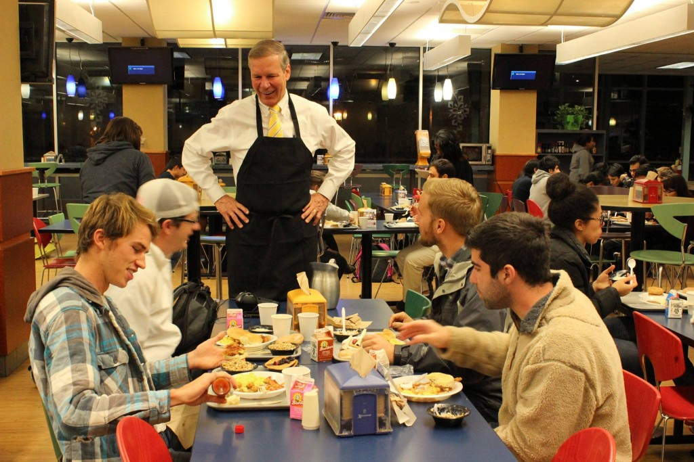
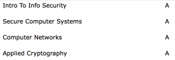

Konec semestru na amerických školách je zcela odlišný než na českých. **Poslední týden má přezdívku „dead weak“ neboli „mrtvý týden“.** Je to tradičně nejvystresovanější týden v roce, protože během něho musí studenti dodělat a odevzdat semestrální/týmové práce. Je to týden, kdy je knihovna plná i v noci, kafe teče proudem a na kolejích panuje tichý režim. Učitelé mají také často zakázáno zadávat další testy či kvízy. S dead weak se pojí i různé tradice. Na Georgia Techu je to **Midnight Madness**. Každou půlnoc během tohoto týdne otevřou lidé na kampusu okna a začnou křičet, což slouží jako odbourávač stresu. V knihovně se během toho také rozdává **kafe a energy drinky zdarma**. V pátek pořádá škola sportovní turnaje. Poslední půlnoc pak zaměstnanci školy včetně prezidenta servírují „snídani“. 

<figure class="floatLeft">
  
  <figcaption>Prezident Georgia Techu G. P. „Bud“ Peterson</figcaption>
</figure>

**Po mrtvém týdnu následuje „final week“ neboli „zkouškový týden“.** Během něho musí proběhnout všechny závěrečné zkoušky. Na každou z nich máte pouze jeden jediný pokus. Neexistují opravy. Termín zkoušek je shodný/podobný s normálním rozvrhem. Pokud si náhodou složíte dvoudenní rozvrh jako já, tak si jich napíšete i více během jednoho dne. **Zkoušky mají typicky váhu 30-35% výsledné známky**, což je celkem hodně. Navíc není moc času na přípravu, protože v mrtvém týdnu se musíte věnovat projektům. Na ČVUTu to bývalo dokonce kolem 50%, ale možnost oprav (i když tu jsem využil snad jen 1x) a rozložení až do 6 týdnů dělala zkoušky daleko jednoduššími. Profesoři pak musí do následujícího pondělí zveřejnit závěrečné známky. Jak jsem dopadl? 

<figure class="floatRight">
  
</figure>

**První semester po 5 letech bez ztráty kytičky.** :-) Nejvíc mě potěšilo Ačko z Applied Cryptography. Byl to jeden z těch předmětů, kde jsem celkem často byl totálně ztracenej. Předmět ke kterému nebylo moc materiálů či cvičných příkladů. Předmět kde jsem málokdy dostal z domácího úkolu víc než 50%. **Jak funguje známkování?** Všichni profesoři použili „curve“ neboli „křivku“. Na konci roku sečtou body z jednotlivých úkolů, zkoušek a projektů a následně dají X% Aček (kolem 30), X% Beček (kolem 40) a několik C, D a F. Výhodou je, že pokud profesor neodhadne přesně náročnost zkoušek, tak to neznamená, že všichni dostanou mizerné známky či rovnou propadnou. 

Třeba v Applied Crypto jsem se pohyboval někde lehce nad 70% a přitom oficiálně by mělo být A až za 90+%. Nevýhodou je pak jistá soutěživost. Sobecky si přejte, aby vaši spolužáci co nejvíce pokazili své testy, protože vám to pak zajistí lepší známku. Také ztrácíte představu o tom, jak si v průběhu semestru vlastně stojíte. **Na ČVUTu se nikdy křivka nepoužila.** V některých předmětech (lineární algebra...) tak bylo extrémně náročné dostat lepší známku než C. Na druhou stranu, abych na Techu získal titul musím ze všech oborových předmětů dostat nejhůře B, z volitelných C a udržet si GPA 3.5+, což znamená mít minimálně půl na půl Ačka a Bečka. **ČVUTem se můžete klidně „proEčkovat“**. Ve výsledku je tak známkování srovnatelné, s tím že na Techu ho uměle posunou o 2 známky výš. Špatná zpráva, pokud se hlásíte na americkou školu a musíte jim vysvětlovat mizerný průměr ze školy české. 

**A jaké byly samotné předměty?** Už jsem to vícemeně popsal [tady](http://blog.miksu.cz/polocas/). Všechny mě dost bavily.  Některé byly lehčí (Intro To Info Security, Computer Networks), těžší (Secure Computer Systems) a na hranici pochopitelnosti (Applied Cryptography). Týmové projekty byly vcelku také fajn. Měl jsem dost velké štěstí na lidi v Applied Cryptography, protože byli jedni z mála, kteří koncepty z předmětu pořádně ovládali a dost mi tak pomohli nejen v projektu ale i v přípravě na zkoušky. Obklopit se schopnými lidmy je půlka úspěchu. 

<figure class="floatLeft">
  
</figure>

K mému překvapení mě předměty nadchly pro celý obor, což je asi to nejzásadnější. Začal jsem číst více blogů zaměřených na bezpečnost a sledovat i některé konference. **Toť v kontrastu se strojovým učením, což byla moje původní volba.** Oblast také rozhodně zajímavá a patří jí bezesporu budoucnost, ale nikdy mi moc nešla pravděpodobnost a statistika. Teorie čísel je mi daleko bližší. Pokud chcete něčemu v informatice opravdu rozumět a přispět, tak velmi rychle narazíte na hromadu pokročilé matematiky bez které se nikam nepohnete. Časem bych chtěl napsat i nějaký článek (články) o tom, co to informační bezpečnost vlastně je a jak se dotýká všech lidí víc než si myslí. Ať už z technického/odborného pohledu tak i filosofického. A třeba i praktického - o tom jak a proč se (ne)chovat na internetu.