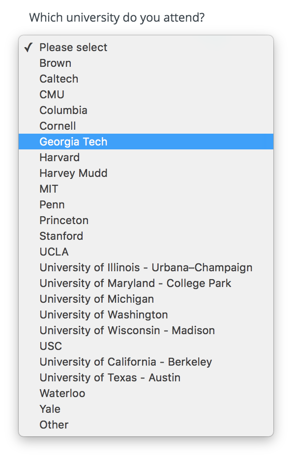
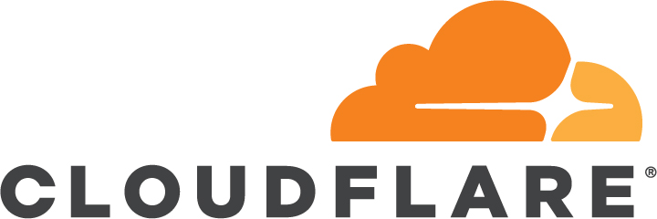
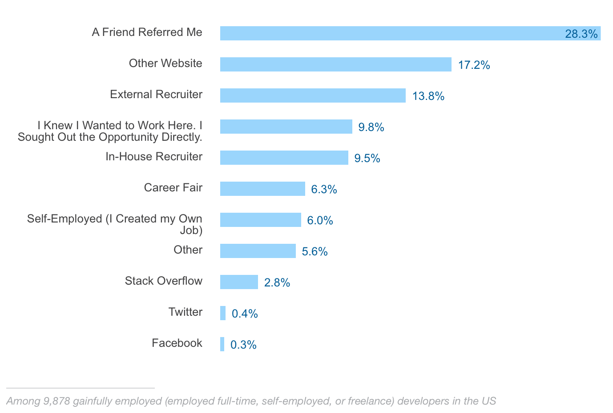

**Jedna z největších výhod cizinců studujících na amerických vysokých školách je ta, že mají relativně snadný přístup ke zdejšímu trhu práce.** Musím však ještě jednou zdůraznit slůvko **relativně**. Legálně pracovat můžete pouze během léta a pouze ve vašem oboru. Mimochodem, letní stáž mohou legálně přes J1 program získat i studenti z českých univerzit. Po absolvování pak existují jisté vízové programy, které vám dají rok až dva možnost opět pracovat v oboru aniž byste museli žádat o pracovní vízum H1B, které většina lidí nemá téměř šanci dostat a ti co podmínky splní, tak skončí v celkem zoufalé loterii. O totálně nefungujícím imigračním systému snad ale později.

**Internshipy** (česky tomu říkáme stáže) **jsou takové celoroční Hunger Games**. Firmy totiž začínají rekrutovat studenty už téměř s ročním předstihem. Existují dva základní způsoby, jak se s firmama dostat do kontaktu.

<figure class="floatLeft">
  
</figure>

**Ta první jsou career fairy.** Velké technické univerzity jako Georgia Tech jsou magnetem pro technologické giganty ale i menší lokální startupy. Konají se na podzim a na jaře. Trvají celý týden a na kampus se sjedou až stovky společností. College of Computing má svůj vlastní oddělený od zbytku školy, protože softwareových společností je zdaleka nejvíc. **O jaké firmy tedy jde?** S těch nejznámějších třeba Apple, Microsoft, Facebook, Google, Amazon, Palantir, Nvidia či Yahoo. Z lokálních třeba Home Depot, Coca Cola, MailChimp či Chick-fil-a. Každá společnost má vlastní stánek s několika lidmi (HR nebo vývojáři), u kterých se tvoří mega fronty nervózních studentů, kteří v ruce svírají propocené životopisy a doufají, že po pár zodpovězených otázkách se jim firma v budoucnu ozve.

**Byla to tak trochu ztráta času.** Obešel jsem firem jen několik (kvůli frontám). Většina z nich si jenom vzala životopis s tím, že se ozvou (což se ani jednou nestalo). Další firmy dávaly technické otázky (Microsoft), což byl alespoň fajn trénink. A takový Google jenom rozdával swag a odkazoval lidi na online formulář. Teoreticky byste měli mít o něco větší šanci, že se vám firma ozve, pokud jí kontaktujete přes career fair než když zvolíte rovnou druhý způsob.

**A tím jsou online přihlášky a emaily!** Většina velkých firem má na stránkách odkaz "Career" a záložku "Internships", kde na vás čeká formulář pro vyplnění. Jde většinou jen o kontaktní údaje, životopis a nepovinný motivační dopis. Přirozenou věcí tak je začít hromadně "sprejovat" všechny firmy, které vás napadnou. V první várce jsem naklikal:

- Adobe
- *Airbnb*
- Amazon
- Apple
- *Atlasssian*
- *Box*
- Digitalocean
- *Dropbox*
- Evernote
- *Facebook*
- *Fitbit*
- Foursquare
- Google
- Hulu
- *MailChimp*
- Microsoft
- *Palantir*
- Salesforce
- *Soundcloud*
- Smyte
- Snapchat
- VMWare
- Twitter
- Yahoo

A pak už jen postupně **dostáváte odpovědi ve stylu**: "*Thank you for applying for the Software Engineer, Intern role at XXX. We’re truly inspired by the talented people who find their way to us, and we know that it took a lot of time and effort on your part. While this is never easy news to share, we’ve decided not to move forward with your application for this position. We appreciate your care in sharing your qualifications and experience, however, other applications have better matched the diverse needs of this role.*"

<figure class="floatRight">
  
</figure>

**Od firem, které nejsou kurzívou jsem nedostal odpověď žádnou.** Speciálním případem byl pak **MailChimp**, kde jsem postoupil k pohovoru po telefonu s HR člověkem, ale tím to také skončilo, což mě dost mrzelo, protože sídlí hned vedle Georgia Techu, mají parádní produkt a působí i jako fajn firma.

**Tohle byla docela rána pro mé sebevědomí.** Čekal jsem, že to bude daleko jednodušší. Krom toho, že to jednoduché opravdu není (i dle zkušeností ostatních) mám ještě pár dalších teorií:

- **Začal jsem to řešit moc pozdě.** Přihlášky jsem poslal až v lednu a některé firmy už internshipy měly uzavřené.
- **Nepsal jsem motivační dopisy** - lenost a moje blbost.
- V resume jsem zbytečně měl poznámku o tom, že mám **J1 vízum**, které má pro většinu národností podmínku, že se musí na 2 roky vrátit do své rodné země před tím, než se mohou ucházet o pracovní vízum. ČR má naštěstí výjimku, což ale firmy při prvotním screeningu pravděpodobně nezjišťují a může vás to tak rovnou odpálit.

<figure class="floatLeft">
  
</figure>

Všimnul jsem si ještě jistého úkazu. Některé firmy (například Dropbox) měly pro **políčko "škola" dropdown s jistým předvýběrem**. Je tak dost možné, že hodnota "other" vás rovnou pošle do nějaké "speciální" záložky. K mému štěstí Georgia Tech v podobných top seznamech je a alespoň něco mi tak hrálo do karet (i když výsledek pořád tristní).

**Nezbylo nic jiného, než rozjet kolo druhé a třetí.** Tentokrát jsem začal psát i motivační dopisy. Respektive měl jsem několik šablon a různě jsem je upravoval (podle "vysněnosti" dané firmy).  Záměrně jsem lovil v oblasti unicornů - privátní společnosti s valuací nad miliardu dolarů. Většinou rapidně rostou, nabírají tak hodně lidí a mají zároveň i prostředky na to uživit stážisty (malé firmy internshipy nenabízejí prakticky vůbec). **Většina firem opět vůbec neodpověděla.** Pár poslalo odmítavý email. A dvě firmy se ozvaly zpět!

<figure class="floatRight">
  
</figure>

**První je [Automattic](http://automattic.com).** Stojí za **Wordpressem** (jeden z nejnavštěvovanějších webů vůbec). Domluvili jsme se hned na pohovoru. Tedy, Automattic je velmi zvláštní firma - je kompletně decentralizovaná. Její zaměstnanci jsou všude po světě a pracují na dálku. Místo telefonování používají pouze textové zprávy a tak **interview byl 2h chat na Slacku s jedním z vývojářů z Bulharska**. **Bylo to parádní.** Po pár obecných otázkách jsme se začli bavit o JavaScriptu a různých konceptech. Nemusel jsem přímo programovat, ale spíše vysvětlovat různé věci - například jak bych popsal rozdíl mezi async a sync událostmi někomu, kdo vůbec neprogramuje. Co si myslím o Promises. Jak nákládám s chybami při optimistic updates. Pak byl prostor i na mé otázky. Slíbil, že se do druhého dne ozve a tak se i stalo.

**Interview se jim líbilo a chtějí mi nabídnout full-time pozici až dokončím školu** (internshipy nenabízejí) s tím, že se budeme dále bavit až na konci léta, protože teď je ještě moc brzo. Typicky zadají cvičný (ale placený) projekt v rozsahu několika týdnů. Pak následuje ještě text chat s CEO a následně konečný verdikt. Ano, dokud vás nevezmou, tak s nima ani jednou nepromluvíte. :) Z Automatticu mám obrovskou radost, protože vypadají jako parádní společnost (podporují opensource, dělají spoustu meetingu po světě, platí v dolarech, vyznávají maximální svobodu a mohl bych hodně cestovat...), ale na léto potřebuju něco jiného.

<figure class="floatLeft">
  
</figure>

**Tou druhou je [Cloudflare](https://www.cloudflare.com).** Tady už to probíhalo klasicky. Nejprve pohovor s HR člověkem, kde jsme se poměrně rychle naladili na stejnou vlnu - **hledají někoho do FE týmu, kdo jim pomůže s přechodem na React**, což je věc se kterou mám hromady zkušeností. Po telefonátu jsem jim poslal pár odkazů a nasdílel některý kód (konkrétně můj pet projekt ChessB). Ten se jim ohromně líbil a tak následovalo dalších několik telefonátů od vývojařů. **Od obecnějších konceptů až po coding challenge**, která byla jednoduchá a velmi praktická a tudíž jsem jí kompletně zvoral. Probíhala za asistence Google Hangouts a sdílení obrazovky. Totálně jsem se vystresnul a udělal všechny chyby, co udělat jdou.

Z téměř jasné nabídky jsem se tak dostal do stavu krávy čekající na porážku. Pár dní jsem doufal v nějakou odezvu, až to moje nervy nezvládly a **napsal jsem jim, že bych rád zkusil další challenge**. Ovšem bez jakýchkoliv výmluv (o nervozitě či jiné). Prostě jen, že mi na tom hodně záleží a chci se zlepšit. A tak mi skutečně zadali další, tentokrát mnohem více komplexní (JS i kódování) a "na doma". Prý ale ať se s tím moc nestresuju. A tak jsem jí za dva večery naprogramoval a poslal.

**O dva dny později telefon z Cloudflare, že mě berou!** Dohodli jsme se také na finanční kompenzaci. Bez váhání jsem přijal jejich nabídku, která je vcelku velkorysá i na nesmyslně drahé San Francisco. Avšak o něco menší než nabízejí giganti jako Google nebo Apple. U letních stážích nemá smysl na rozdíl od full-time pozice moc smlouvat (pokud se tedy o vás všichni neperou, což nebyl úplně můj připad, heh).

**Něco o Cloudflare.** Sídlí v jedné ze známých částí San Francisca (SoMa) hned vedle firem jako Dropbox, Docker nebo Uber. Mají asi 250 zaměstnanců. **Proudí přes ně slušná porce světového internetu. Jejich služby jsou DNS hosting, content delivery network, ochrana před DDoS útoky atp.** Mají ještě další kanceláře v Londýně a Singapuru. Na IPO se teprve chystají (valuace v řádu miliard $) - pořád jsou tak typickým superúspěšným tech startupem. S vývojářema jsem si skvěle rozuměl, nekteré jsem znal i z GitHubu (jeden z nich je třeba core contributor Babelu). Cloudflare i hodně podporuje opensource a webové technologie, což je také super. A zaměření na internetovou bezpečnost už je taková třešnička na dortu.

<figure class="floatRight">
  
</figure>

Hunger Games jsem tedy přežil, i když to vypadalo už hodně chmurně. Nakonec vyšla i jedna z pro mě top společností. V létě už začnu hledat i full time pozici (školu ukončím už v prosinci). Mělo by to být snad jednodušší. Místa pro internshipy bývají daleko omezenější. Navíc budu mít v životopise další super zkušenost a snad přes léto nasbírám v SF i nějaké ty (veledůležité) kontakty. Dalším želízkem v ohni je samotný Cloudflare. Pokusím se být přes léto pro ně natolik platným, aby mi nabídli i stálou pozici.

Takovou menší náplastí na sebevědomí je fakt, že v obou pohovorech, **kde jsem se dostal až k vývojářům a tedy i technickým otázkám, jsem uspěl**. Největším problémem tak je dostat se skrz první kolo a personalisty. Většina firem dává přednost lidem na doporučení. Pokud máte někde známého a ten vás doporučí, máte jistotu, že se vám někdo ozve. To jsem udělal s Facebookem a vyměnil si tak alespoň pár emailů s jejich personalistkou. **Networking je tak nepřekvapivě zcela zásadní!** Ostatně to jasně dokládá i [StackOverflow anketa](https://stackoverflow.com/research/developer-survey-2016#work-job-discovery).
