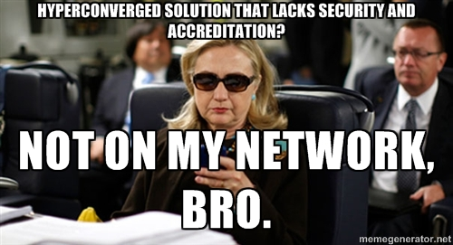

**Další semester hotov a cesta Georgia Techem se tak blíží k zdárnému konci.** Na jednu stranu je super po šesti letech a čtyřech různých vysokých školách vidět světlo na konci tunelu. Na druhou je to taky tak trochu smutné. Dostat se na Tech byl několikaroční proces a když tu konečně jsem, tak si připadám, jak v zrychlené bublině. Pod závalem projektů, úkolů a hodin není moc času nazbyt a všechno velmi rychle utíká. Rok je navíc ona kritická doba, kdy se někde konečně usadíte, vyznáte se dobře v okolí, uděláte si kamarády a život začne být pohodlný. A za půl roku zase od znova.

V letním semestru jsem si zapsal opět 12 kreditů aka čtyři předměty.** Celkově byl semester lehčí než ten zimní**. Za prvé, už jsem věděl, jak tu věci chodí a tak jsem lépe soustředil čas do věcí, které přinesly největší hodnotu (například nemá smysl trávit hodiny čtením textbooků pokud rozumíte výkladu v hodinách). Za druhé, ani jeden z předmětů nebyl tak pekelný jako Applied Cryptography, ve kterém jsem se plácal od začátku do konce.

## Network Security (A)

Síťová bezpečnost. Jediný předmět z mého povinného InfoSec okruhu. **Soustředil se na kryptografii, DNS a DDOS útoky, malware a botnety, detekování anomálií.** Nejlepší částí byly studie reálných útoků z poslední doby a vhled do toho, jak probíhají state-of-the-art útoky na důležitou infrastrukturu. Profesor a jeho laboratoř se soutředí na výzkum DNS, například sbírají ohromné množství dat od velkých amerických operátorů a pomocí různých klasifikátorů se v nich snaží najít zajímavé vzorce. Velkou částí předmětu byl týmový projekt. Náš se zabýval sbíráním záškodnických IP adres, domén atp. z různých blacklistů. V projektu nejspíš budu pokračovat v rámci praktika, jelikož i tyhle data poskytují zajímavé souvislosti.

## Software Analysis and Testing (A)

Softwarová analýza a testování. Nejtěžší a nezajímavější předmět. **Věnoval se různým druhům testování, (částečně) automatizovaným a různým pokusným.** Většinou daleko mocnějším než těm, které se dnes běžně používají. Vše se motalo kolem dynamické, statické a hybridní analýzy. Měli jsme celkem 8 různých programovacích úkolů, někdy se daly zvládnout za pár hodin, jindy však zabraly i několik dní. Vždycky mě bavilo vše kolem automatů, kompilátorů a podobným oblastem CS. Navíc bylo super, že to nebyl jenom teoretický předmět, ale mohli jsme si i zaprogramovat. Midterm a závěrečná zkouška byly takovou sérií různých hádanek a simulací některých algoritmů, což mě vždy dost baví.

## Internet Architecture and Protocols (B)

Internetová architektura a protokoly. **Máte 100GB síť. Router tak musí klasifikovat a přeposlat jeden paket v řádech nanosekund, jaký algoritmus a logické obvody použít?** V Computer Science je spousta předmětů, které se věnují algoritmizaci a datovým strukturám, většinou však jen velmi teoreticky. Tenhle předmět na to jde velmi prakticky a kombinuje dohromady tak nějak všechno (včetně hardwaru), protože je potřeba vše optimalizovat až na dřeň. Známé CS algoritmy/datové struktury se tak vylepšují pomocí různých vychytávek, mikrooptimalizací a zkratek, aby dnešní internet mohl být tak rychlý. Každá "prasárnička" je dovolená, pokud ušetří další instrukci či místo v paměti. Až do tohodle předmětu jsem neměl páru, jak komplikované vlastně je udržet internet v "optických" rychlostech a "Network Algorithmics" byl tak pro mě úplně nový svět.

## Advanced Internet Systems (A)

Pokročilé internetové systémy. Zatím nejhorší a současně nejlehčí předmět, co jsem na Techu měl. **Byl tak nějak o všem a tudíž o ničem.** Většina materiálů byla dost zastaralá a nikdy se nešlo do hloubky. Takové povídání o celém internetu. Profesorka učí ještě další 2 předměty v podobném stylu. Nedává žádné testy, celé známkování je založené jen na domácích úkolech a docházce. Přijde mi, že je to takový ten předmět, který si studenti zapisují, aby si zlepšili průměr a měli více času na ty zbývající. Nicméně v rámci předmětu jsme dělali projekty a tak jsem na to napasoval svůj side projekt ChessB a implementoval alespoň pár věcí.

<figure class="floatLeft">
  
</figure>

Bylo fajn, že jsem měl tentokrát větší možnost výběru, jelikož většinu oborových předmětů jsem udělal už na podzim. Až na Advanced Internet Systems mě všechny předměty dost bavily. Konec semestru byl tradičně velmi výživný - aneb opět se mi tak trochu sesypal po dobu 2 týdnů běžný denní režim (cvičení, normální jídlo, spaní, zdraví...), **ale nakonec se všechno podařilo dotáhnout.** Příští (poslední) semester by měl být volnější, jelikož budu mít jen 2 předměty a praktikum (individuální práce, tak trochu ve stylu diplomky ale bez diplomky, nicméně mohla by z toho vypadnout publikace).

**Nyní 2 týdny prázdnin a pak hurá do San Francisca**, což bude nejdůležitější léto v mém životě. Krom práce v [super společnosti](https://blog.miksu.cz/hledani-internshipu/), na kterou se hodně těším, budu muset zároveň obrážet i všemožné firmy, eventy, hackathony, meetupy a hledat svou první full-time práci, protože v lednu 2017 mi začne odtikávat 15 měsíců, kdy můžu v Americe pracovat bez pracovního víza.
