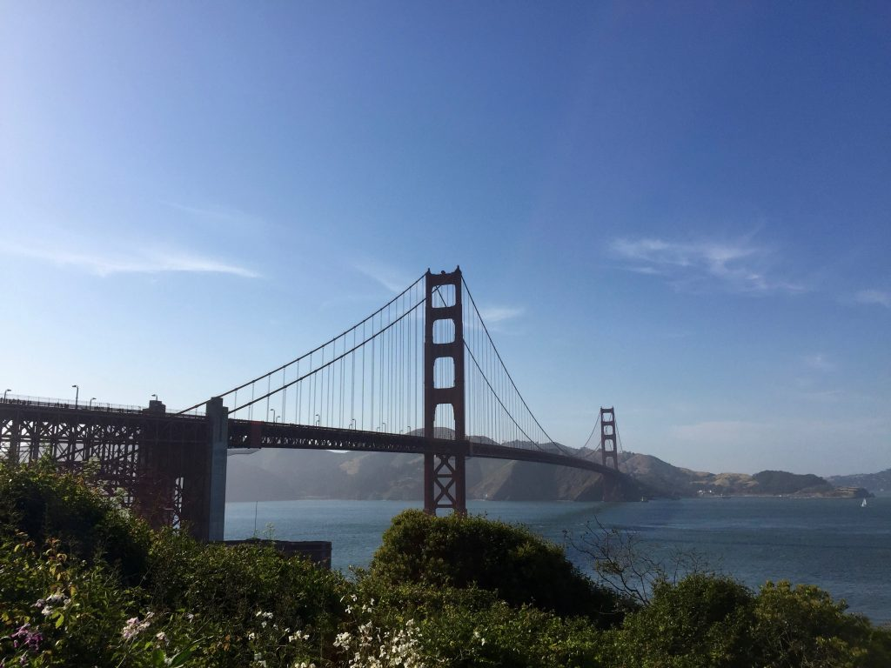
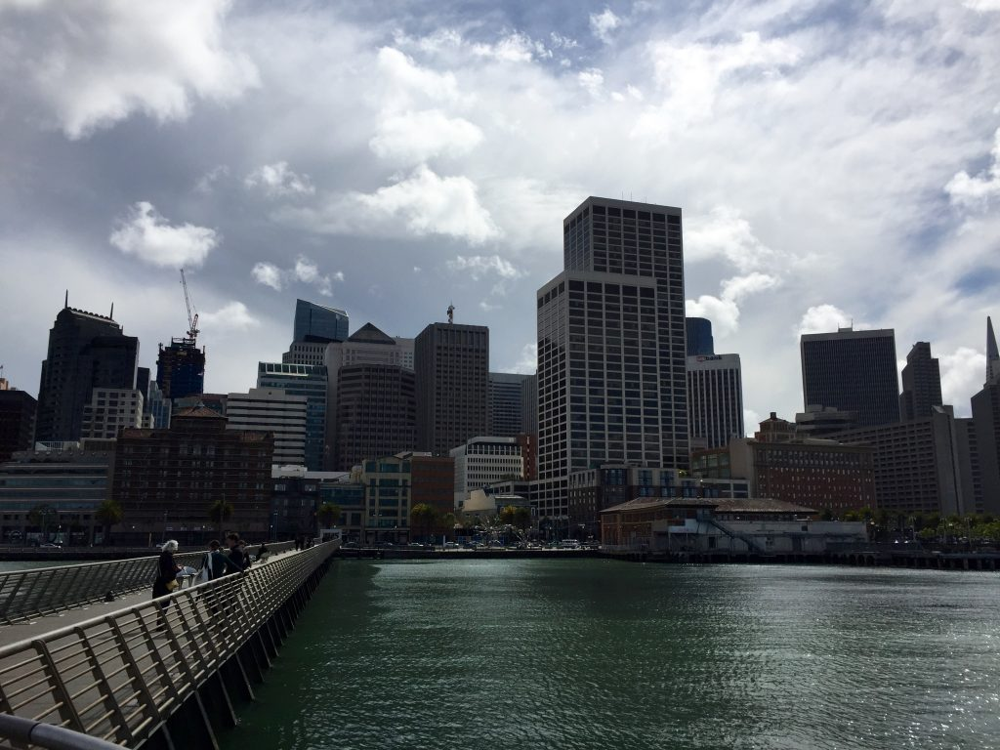
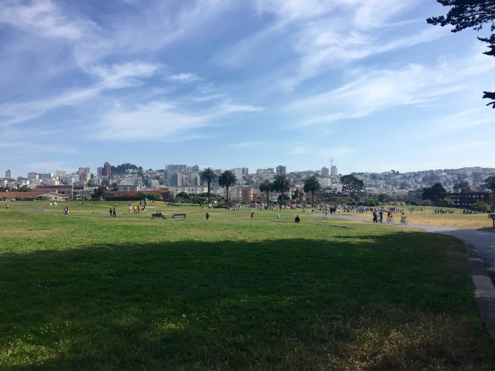
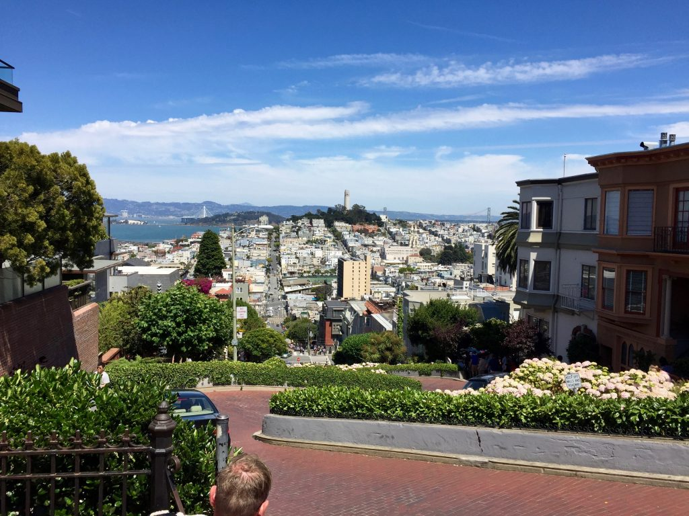
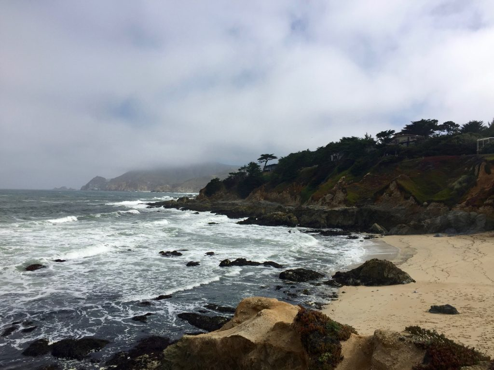
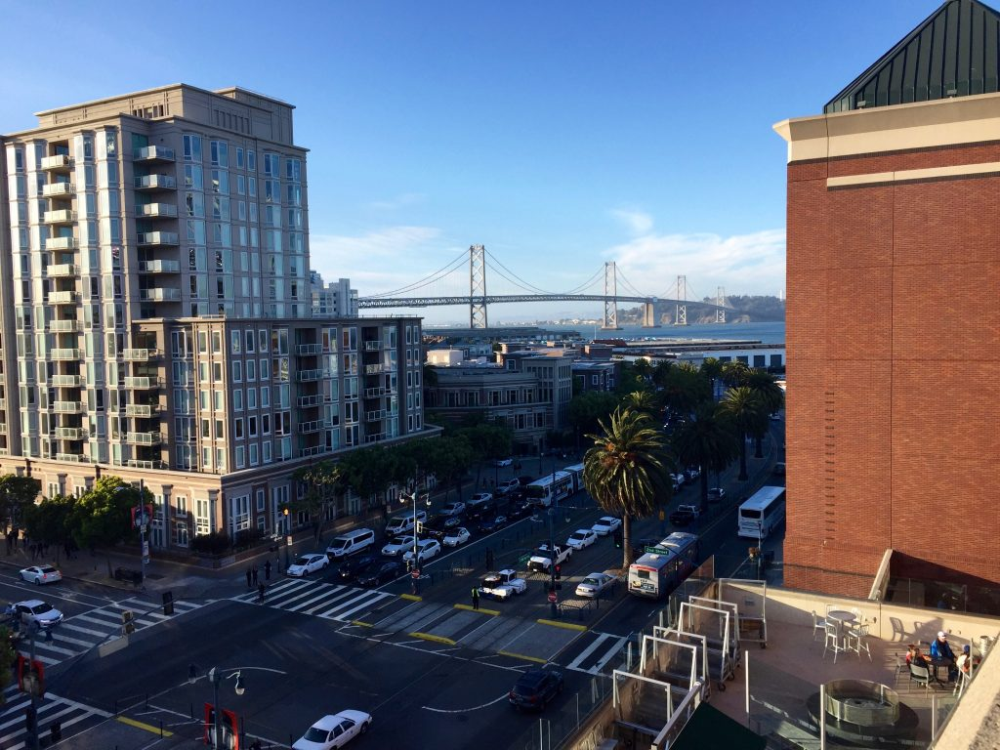
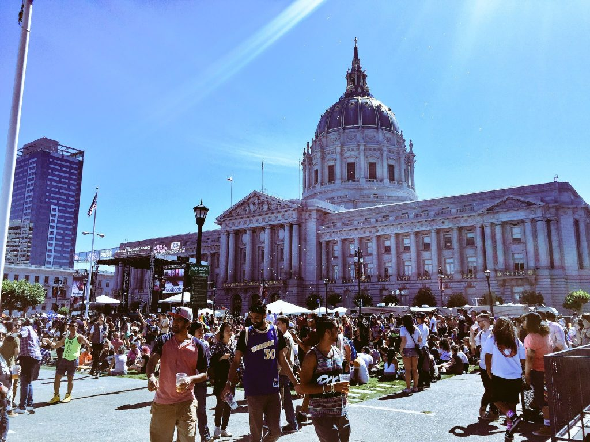

**Pokud byste mohli navštívit jenom jedno město v Americe, muselo by to být San Francisco.** Proč? Protože je nejhezčí! No dobrá, tohle je subjektivní a navíc jsem zas v tolika jiných městech nebyl. Nicméně kde jinde najdete stavbu jako Golden Gate Bridge? Výhledy na rozvlněný oceán? Prosluněnou zátoku s dalším obřím mostem? Extrémně příkré ulice? Úžasné průhledy skrz horizont do všech směrů? Architekturu připomínající evropské středomoří, Asii, továrny přestavěné na open-space kanceláře, klasické mrakodrapové business centrum? Mlhu plázící se skrz ulice, objímající vrcholky kopců a vytvářejíc tak neuvěřitelné scenérie?

<figure class="floatLeft">
  
  <figcaption>Golden Gate Bridge</figcaption>
</figure>

San Francisco ale není jen pěkná tvářička. **Je to pravděpodobně nejliberálnější místo v celé Americe**. Střízlivý středoevropan by to mohl popsat slovem "bizarní". Nicméně více by se slušela použít nálepka "oslava jinakosti". Ona existuje tolerance a tolerance. Ta první končí tam, kam naše oko nedohlédne. Tam kde se nás to netýká. Tam kde končí nějaký paragraf antidiskriminačních zákonů. Ta druhá, skutečná a upřímnější, je však daleko vzácnější a pokud se dá vůbec někde vypozorovat, tak právě v San Franciscu (Neplést s politickou korektností!). Jak se to pozná? Nevím jak to vlastně popsat. Je to v lidech. Plyne to z konverzací, stylem jakým o životě a světě kolem sebe přemýšlí. Možná něco přidávají do vody. Nevím.

<figure class="floatRight">
  
  <figcaption>Downtown</figcaption>
</figure>

**Další charakeristikou města jsou technologické společnosti.** Ground zero. Zaměstnávají desítky tisíc lidí, fungují globálně a udělali ze San Francisca nejdražší město v celé Americe. Je to tak ráj geeků. Máte nápad na nějakou službu? Začnete tady a pokud se uchytí u San Francisčanů, spustíte jí v dalších amerických městech a po pár letech možná i v Evropě. Pokud chcete testovat nejnovější aplikace a gadgety, tak jste na správné adrese.

<figure class="floatLeft">
  
  <figcaption>Marina</figcaption>
</figure>

**Kalifornie.** San Francisco není izolované samo pro sebe. Je vcelku malé (menší než Praha počtem obyvatel a daleko daleko menší rozlohou). Je ale v Kalifornii. Stát, který má úžasnou přírodu a počasí. Stačí popojet kousek na jih a najdete parádní pláže kde se prohání surfaři. Za pár hodin dojedete do národních parků jako Yosemite nebo Sequoia. Nebo Lake Tahoe, kde si i zalyžujete. Sunshine state je sice Florida, ale dalo by se argumentovat, že právě Kalifornie má to pravé ideální počasí. Slunečné, suché, příjemně teplochladné a extrémně stabilní.

<figure class="floatRight">
  
  <figcaption>Lombard St</figcaption>
</figure>

Všechno má ale i své záporné stránky. **Největším průserem San Francisca, že si v něm téměř nikdo nemůže dovolit bydlet.** Trh s bydlením je bez nadsázky totální apokalypsa, která navíc nemá ani žádnou naději na zlepšení. Díky tech společnostem tu každý rok vznikne hromada vysoce placených pozic, která už roky převyšuje počet nově vystavěných bytů. Protože poptávka a nabídka, ceny se vyšroubovaly do absurdních výšek.

<figure class="floatLeft">
  
  <figcaption>Ocean Side</figcaption>
</figure>

**Pokud byste chtěli bydlet sami, v slušně vypadající garsonce, připravte si kolem $3000 za měsíc.** To je taková raketa, že i s vysoce nadprůměrnými platy se životní úrovní jen těžko přiblížíte ostatním Americkým městům. Ze San Francisca se tak stalo místo, kde v podstatě výhradně bydlí jen programátoři a bankéři. A to ještě většinou minimálně po dvou v jednom bytě.

<figure class="floatRight">
  
  <figcaption>Bay Bridge</figcaption>
</figure>

**Dalším problémem města je bezdomovectví.** Podle odhadů jsou jich na ulicích kolem 10 000 a město má jen asi 1000 lůžek. Na rozloze 10x10km tak na ně narazíte prakticky všude. Vůbec nejviditelnější je to v centru na Market Street (kde teď bydlím), v noci tu spí na ulicích přes 4000 lidí (a to jsme relativně malá čtvrť). Pokud  to nečekáte, tak se připravte na šok. Naštěstí tito lidé nejsou nijak nebezpeční. Většinou si vás nevšímají nebo jenom žebrají. Ovšem občas jsou pod vlivem nějakých drog nebo mají různé mentální nemoci a musíte být tak trochu obezřetní. Moc nerozumím tomu, proč není město schopné zřídit třeba víc míst, kde by mohli alespoň přespat.

<figure class="floatLeft">
  
  <figcaption>Civic Center</figcaption>
</figure>

Když to shrnu. Na San Franciscu je nejlepší to, že má svůj jedinečný charakter. Je zcela unikátní a nenapodobitelné. Má bohatou historii a kulturu. Je v něm vždy co dělat. **Ideální místo pro hledání práce.** Nepůsobí přelidněně. Život tu není uspěchaný. Všude úžasné výhledy a vždy pěkné počasí. Dá se celé krásně přejít pěšky nebo projet na kole. To vše z něj ale paradoxně udělalo místo, kde je nyní téměř nemožné bydlet díky ultravysokým nájmům.
