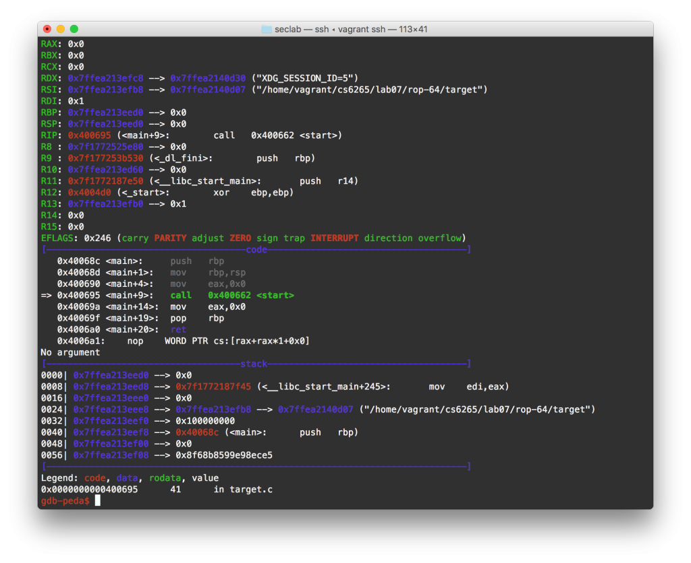

**Od konce léta v San Franciscu se událo několik zásadních věcí.** Tak především přestěhoval jsem se zpět do Atlanty, kde dokončuji posledních pár měsíců mého jeden a půl ročního programu na Georgia Techu. Co říct? Uteklo to opravdu rychle! Poslední semester je dost odlišný náplní od těch předchozích.

**Nemusím psát diplomovou práci ani skládat nějaké závěrečné zkoušky.** Ovšem musím vytvořit smysluplný projekt, který je relevantní v oblasti InfoSec. Jak si takový projekt vymyslet? Studenti se jednoduše nasáčkují k jednotlivým profesorům a jejich laboratořím . Tyto laboratoře mají většinou kolem 5 - 15 lidí, většinou studenti PhD nebo Postdocs a pár Masters (což jsou typicky lidé jako já, kteří potřebují "oddělat" svůj semestrální projekt). Jsou výhradně orientované na výzkum a publikování. Fungují podobně jako malé firmy (ta naše třeba dělá standupy, používá Slack, GitHub... atp.), akorát místo releasování produktu se řeší deadliny konferencí. Moje laboratoř se věnuje síťové bezpečnosti a zejména DNS. Sbírají velké množství dat (aktivní i pasivní DNS requesty). Pracuju na vizualizaci těchto dat, tak aby například forenzní tým mohl vidět, ve kterém IP (či GEO) prostoru vzniklo hodně podezřelých domén.

**K tomu mám ještě dva normální předměty.** Jeden je strojové učení pro obchodování. Ten je vcelku odpočinkový  a i velmi zábavný. Ostatně je celý na Udacity (naprosto shodný s verzí na kampusu) tak se [mrkněte](https://classroom.udacity.com/courses/ud501/). Ovšem ten druhý stojí za to! **InfoSec Lab. Je to ten nejtěžší kurz jaký jsem kdy na VŠ měl a to o parník.**

Je to kurz zabývající se hardcore hackováním. Zatímco předchozí InfoSec předměty byly tu víc kecací, tu více matematické, v InfoSec si "vyhrnete rukávy" a píšete reálné exploity. Probíhá to tak, že každý týden dostaneme 10 úkolů. Je to 10 binárek (bez zdrojového kódu). Cílem je dostat z nich určitou informaci. Celkem máme 10 týdnů aneb 100 úkolů v rámci jednoho semestru! Na Ačko je potřeba hacknout v průměrů 7.5 binárek každý týden, 5.5 na B (musím dostat minálně B abych dokončil program). Původně to bylo 9 z 10 na A.

<figure class="floatLeft">
  
  <figcaption>GDB a peda</figcaption>
</figure>

**Jak takové hackování probíhá?** GDB, GDB a ještě více GDB. Program má vždycky nějaký vstup a slabinu. Pokud správně složíte dohromady vstupní zprávu, dostanete onu určitou informaci (tu pak odešlete do jejich systému a dostanete body, takovej zvrácenější ProgTest). TLDR; Stovky hodin luštění assembly kódu, studování Intel manuálů, psaní shellcodů, ROP, return-to-libc, logic bombs, brute force, přepisování file descriptorů, hackování symlinků, napadání vzdálených serverů, [NSA codebraker challenge](https://codebreaker.ltsnet.net/challenge)... atd. Začíná se zlehka (povypínáné ochrany binárky). Od půlky už však jsou zapnuté věci jako CANARY, ASLR a PIE (randomizace paměti), NX (non executable stack)... v podstatě ochrana na úrovni běžných moderních programů. Každá ochrana hackování podstatně stěžuje, ale vždycky je tam nějaká skulinka. Proč tam ty skulinky jsou? Protože programátoři dělají chyby a udělat tyto ochrany perfektní by znamenalo hodně ponížit výkon.

Učí ho tým lidí, kteří vyhráli Capture The Flag na loňském Defconu, což je taková olympiáda pro všechny hackery. Také získali v roce 2015 stovky tisíc dolarů z bug bounty programů. Jelikož nejsem schopen (tak jako téměř všichni) vyřešit všechny problémy, tak s předmětem trávím prakticky všechen čas (krom menších úseků kdy se musím věnovat projektu a druhému předmětu). I když po několika týdnech jsem se už naučil "vzdávat" jinak by mi z toho přeskočilo. Utvořilo se několik velkých skupin lidí a tak si v tom pomáháme (což doporučují i instruktoři, jinak je to opravdu šílenost). **Musím však říct, že je to nejlepší předmět, jaký jsem tu měl.** Nemyslím si, že bude hodně škol, které by nabízeli reverse engineering kurz na takové úrovni.

Tolik ke škole. **Druhou zásadní události bylo to, že jsem podepsal smlouvu s [Cloudflarem](https://www.cloudflare.com)** (společnost pro kterou jsem v létě pracoval). V lednu se tak stěhuju zpět do San Francisca, tentokrát snad už nadobro! Nabídku mi dali týden před koncem internshipu, což jsem už dle reakcí během léta čekal. Myslím si, že Clouflare je pro mě téměř ideální firma. Splňuje prakticky všechna moje kritéria (pozitiva):

- Není to mini firma, má 300 lidí, potřebuji stabilní zázemí kvůli vízu (je to neuvěřitelně komplikovaný proces, který se neobejde bez právníků... o tom někdy jindy), znám jejich finance - nemusím se bát, že za půl roku skončí (jejich valuace je už teď v miliardách dolarů)
- Není to obří firma, ve firmě která má 10000 lidí nemáte tolik šanci něco ovlivnit
- Je to startup, respektive privátní společnost která se v dohledné době chystá udělat IPO, což je klíčové, protože součástí kompenzace je i vlastnický podíl
- Líbí se mi co dělají, DNS, bezpečnost, DDoS ochrana, SAAS, kryptografie, spousta chytrých lidí...
- Věřím tomu, že mají velký potenciál, už těď mají obrovskou síť 100 datacenter (10TB trafficu, 10% světového trafficu jde přes jejich servery), možná zabiják Cisca? :)
- Potřebují mě, spousta projektů stojí na tom, že nemají front-end developory, kteří by jim vytvořili UI
- Velmi aktivně podporují <a href="https://github.com/cloudflare">open source</a>, používají cutting-edge technologie
- Sídlí v San Franciscu (chci za každou cenu bydlet v San Franciscu) ... Silicon Valley je překvapivě rozlehlé a dostat se třeba do takového Googlu znamená hodinu cesty po ucpané dálnici. Mají i kancelář v Londýně.
- Většinu z nich už znám a jsou to moc fajn lidi!

Samožřejmě jsem se nespoléhal jen na nabídku od Cloudflare, ale využil jsem známosti a zkusil interview i v jiných společnostech. **A to v Googlu (konkrétně YouTube divize) a Facebooku.** V Googlu jsem prošel až do závěrečného kola, kdy si vás pozvou na celý den do jejich kanceláře, kde vás "grilují". Celkem čtyři různé interview, programování na bílou tabuli. Vedl jsem si vcelku dobře (i dle feedbacku od recruitera), nicméně nabídku jsem nakonec nedostal. Je celkem pravděpodobné, že se mi ještě v příštím roce ozvou. Celkově to byla super zkušenost. Mohl jsem si udělat extra výlet do San Francisca a podívat se jak YouTube funguje. U Facebooku jsem bohužel zazdil jeden z jejich phone screeningů a tím to skončilo. Hořké na tom bylo, že jsem téměř stejný problém řešil u Cloudflaru ale měl jsem nějaký výpadek. :)

Co bych si vybral, kdybych dostal nabídky od těchto "gigantů"? Popravdě do Googlu by se mi moc nechtělo. Ano, mají krásné kanceláře, lidé jsou tam moc fajn a celkově jsem měl výbornou zkušenost (A je to GOOGLE!). Pro front-end vývojáře ale bohužel nemají moc co nabídnout (dost jim tu ujel vlak v posledních letech). Dělal bych tak v technologiích, které mě nebaví a které používá jen Google (Google Closure) na projektu, kde bych měl minimální vliv na výsledek (páč mají podobných vývojářů 1000...). Navíc, YouTube je už v podstatě hotový a etablovaný projekt. Jedině se úplně přeorientovat někam jinam (například dělají zajímavé věci s VR). U Facebooku je to jiná písnička. Mají opravdu špičkový tým vývojářů a určují teď ve frontendu tempo. Jediným negativem by bylo zdlouhavé dojíždění do Menlo Parku. Facebook je asi jediná firma, které bych dal přednost. A to i přesto, že mě ani tak moc nebere jejich produkt - mají jednoduše úžásný engineering.

Chození na pohovory je dost zdlouhavý a vysilující proces. Je to skill sám o sobě. Mluvil jsem ještě s pár dalšíma menšíma firmama, když jsme se nějak náhodně potkali. Ale už jsem nedělal žádné hromadné obepisování jako když jsem hledat internship. Neměl jsem k tomu motivaci ani čas. **Cloudflare mi vyšel ve všem maximálně vstříc a věřím, že to bude výborný začátek kariéry!**
