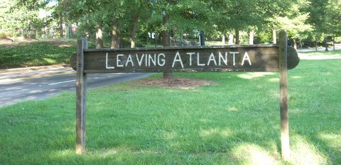

**Po roce a půl je moje studium na Georgia Techu úspěšně u konce.** S tím přichází i zásadní životní zlom aneb opuštění akademického prostředí jednou pro vždy a nástup do první full-time práce. Už není cesty zpět. Žádný záložní plán.

**Poslední měsíce mě škola stála hodně energie a bylo těžké to neflákat.** Vlastně od chvíle, kdy jsem podepsal smlouvu s Cloudflare už mi mohlo být celkem jedno s jakým průměrem školu zakončím, hlavně pokud jí zakončím úspěšně.

Typické vyhoření uprostřed semestru bylo tak o to hlubší. Během prvních dvou měsíců se snažím, nasbírám hodně bodů za domácí úkoly, napíšu dobře testy... no a **pak přijde nutkání zvolnit a nějak to doklepat**. Načež následuje pár závěrečných hektických týdnů, kdy je potřeba se opět dokopat k vyššímu tempu.

O předmětech jsem psal už [minule](https://blog.miksu.cz/podzim-v-atlante/). **Tím nejlepším** (a tím myslím i za celkové studium na Techu) **byl InfoSec Lab**. Opravdu hutný a praktický kurz co se reverse engineeringu/hackování týče. Záverečné úkoly byly těžší a těžší. Místo posledního labu věnovanému sandboxingu a kernelu jsme mohli vyřešit [prompt.ml](http://prompt.ml/) (webové útoky), což mi hodně pomohlo. V kombinaci s mírnějším známkováním jsem nakonec dosáhl na nejhorší Ačko, což je ideální stav.  :) Practicum a Machine Learning for Trading už tak hrozné nebyly. Tedy až na pár provztekaných nocí s Pythonem, Pandas a vektorizací výpočtů (jinak je Python ukrutně pomalý).  Pro practicum jsem pak vytvořil [ipviz projekt](http://ipviz.gtisc.gatech.edu).

<figure class="floatLeft">
  
</figure>

**Stěhování je naprd.** Nic nového. I tak je vždycky smutné opustit po více než roce lidi, kteří se stali druhou rodinou. Alespoň pomáhá fakt, že se tentokrát nestěhuju do jiné země a bude tak jednodušší se do Atlanty občas zastavit (už teď mám náplanovou cestu zpět v dubnu). Z druhé strany pak není potřeba nikoho 2x přesvědčovat o výletu do San Francisca. Výhodou také je, že SF už znám a stejně tak firmu, kde budu pracovat. Odpadá tím stres z neznámého.

**Vlastně se do SF hodně těším.** Dostudováním školy se otevřela brána možností. Cloudflare bude super zkušenost. Behěm příštích dvou let firma znásobí počet zaměstnanců, začne otevírat více zahraničních poboček, stane se veřejnou (IPO) a já u toho všeho budu moci být! Naučím se spousty nových věcí, poznám nové lidi a snad i potkám budoucí spoluzakladatele mého startupu. :)

Za hodinu jedu vyzvednout z letiště taťku a ségru. V pátek máme slavnostní promoci. A pak strávíme pár týdnů na Floridě a jeden týden v New York City. Poté se na pár dní vrátím do Atlanty a 5. ledna konečně letím do SF.

**Ať se vám daří v 2017!**
