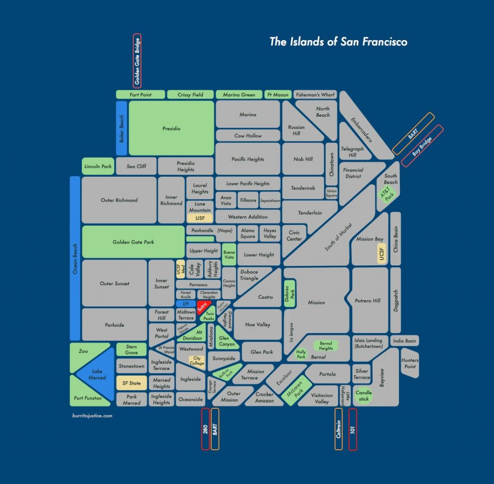
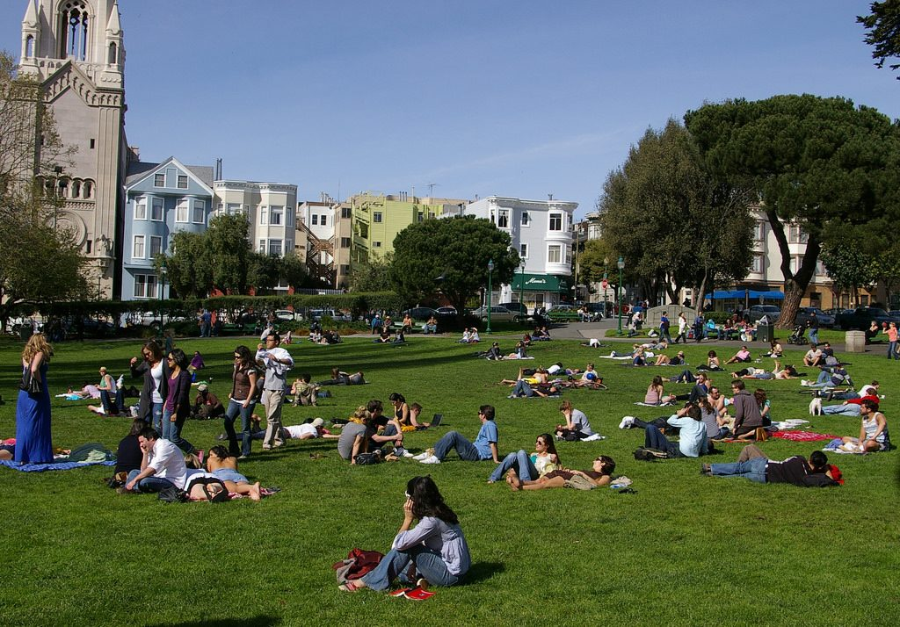
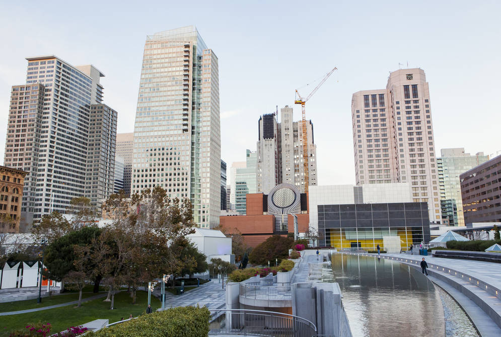

V jednom z [předchozích článků](https://blog.miksu.cz/san-francisco-a-zivot/) jsem napsal, že největším průšvihem SF jsou náklady na bydlení a za posledních 6 měsíců se to nijak nezlepšilo. Když jsem tu byl v létě, šel jsem po ceně a maximální úspoře. Platil jsem $1800 měsíčně za byt, který měl 2 ložnice a 2 koupelny. **K tomu ale i dalších 7 spolubydlících**. Alespoň byl luxusní (v jednom z nových věžáků), nicméně zase v nejhorší části města.  Kombinace léta, krátkodobého Airbnb a San Francisca je finanční harakiri.

**Teď v lednu jsem se do San Francisca přestěhoval na stálo** a musím tak opět hledat bydlení. Do karet mi alespoň hraje několik věcí:

- v lednu je o něco menší poptávka než v létě
- Cloudflare mě nechává 3 týdny bydlet v jejich služebním bytě (takže mám dost času na hledání)
- dlouhodobější bydlení je levnější
- trh se maličko zbrzdil po několikaleté jízdě směrem do nebe

**Medián za byt 1+1 je na nyní [$3300/měsíc](http://www.bizjournals.com/sanfrancisco/news/2016/12/21/san-francisco-rent-decline.html)</a>**, což je více než ve zbytku země včetně NYC. Proč jsou nájmy tak vysoké? Nabídka vs poptávka. San Francisco je vcelku malé a velmi se brání výstavbě nových bytů. Podobná ne-li horší situace je i ve zbytku poloostrova (přezdívaného Silicon Valley) a tak spousta lidí, kteří pracují ve Valley (Google, Facebook, Apple...) bydlí v SF a do práce dojíždí klidně i hodinu a půl denně každým směrem.  To je dost bizarní. Ve zbytku Ameriky je to přesně naopak, lidi dojíždí za prací ze suburbs do města.

Dalším důvodem je to, že SF a zbytek poloostrava se stalo středobodem technologických společností, které koncentrují ohromné množství peněz a mohou tak desítkám tisíc zaměstnanců dávat výplaty, které jsou vysoko nad průměrem ostatních oborů. Pro představu, jen Apple + Google + Facebook mají dohromady 150 000 zaměstnanců, jejich roční obrat je $350 miliard, to je nějakých $2.3 mil na zaměstnance. Samozřejmě ne všichni pracují v centrálách ve Valley.

San Francisco je navíc hodně socialistické a snaží se tvrdě (leč úplně marně) bojovat s trhem, tak aby ve městě nezbyli jen programátoři, bankéři a doktoři. **Zavedlo tak kontrolované nájemné**. **Vztahuje se na starší byty ale i tak mu podléhá 70% všech bytů ve městě!** Pokud si takový byt najdete, vlastník vás nemůže po roce vyhodit a nemůže vám zvýšit nájem (respektive pouze o maximální schválenou částku městem, což je typicky méně než 1%).  Pokud jste se do SF nastěhovali před 10 lety, tak nyní platíte třeba čtvrtinu reálného nájmu. Jakmile se odstěhujete, vlastník může zvýšit nájem libovolně. Je tak jasné, že tahle obrana je jen dočasná a chudší lidé stejně postupně z města vymizí. **Tím, že město zavádí brutální regulace, se trh ještě více pokřivuje a ve výsledku tak zvedá tržní nájmy**. A dalším důsledkem je, že velká část bytů jsou v dost bídném stavu, protože vlastník ztrácí motivaci do nich investovat.

<figure class="floatLeft">
  
  <figcaption>Mapa - čtvrtě San Francisca</figcaption>
</figure>

**Při hledání bytu potřebujete znát dvě hlavní věci.** Ta první je maximální částka kterou jste ochotni za měsíc utratit. Pro mě to je $3000. Existují nějaké obecné poučky závislé na výši vašeho platu. Oblíbené je pravidlo 50/30/20. 50% na nezbytné výdaje (bydlení, energie, jídlo, internet a telefon), 30% na zábavu, oblečení, výlety a 20% šetřit. Samozřejmě čím méně na nezbytné výdaje tím lépe. Například pokud bych pracoval v Silicon Valley, strávil 3h denně dojížděním a do bytu se jezdil tak akorát vyspat, snížil bych nároky na byt a raději více šetřil. Tím, že pracuju ve městě a strávím v bytě více času, má smysl do něj i více investovat.

**Ta druhá je část města, kde chcete bydlet.** Kanceláře máme v South Beach. Hledám ve třech částech.

## North Beach

- jedna z nejstarších částí města s bohatou historií
- blízko China town a Downtownu, bydlí tam tak i hodně bankéřů
- spousta kaváren, restaurací, barů, Washington Square Park
- velmi živá i o víkendech a večerech
- poblíž pobřeží
- poblíž většině turistických atrakcí San Francisca (Fisherman's wharf, Coit Tower, Lombard Street, Pier 39)
- je poměrně blízko práci do které vede pěkná 3km cyklistická stezka podél zátoky (bez převýšení)

<figure class="floatRight">
  
  <figcaption>Washington Square Park v North Beach</figcaption>
</figure>

## Mission

- nejvíc hipsterská část města
- opět spousta vyhlášených podniků za rozumné peníze
- Dolores park, park s nejhezčím výhledem na město
- velmi živá i mimo pracovní dobu
- centrální pozice, linka metra (BART)
- nejslunečnější část města, v SF je v tomhle obrovský rozdíl (ozbvlášť mezí zamlženým západem a slunečným východem)!

<figure class="floatLeft">
  
  <figcaption>Dolores Park v Mission</figcaption>
</figure>

## SOMA

- nejnovější čtvrť města, dříve továrny
- byty jsou typicky novostavby, luxusní věžáky
- velmi blízko naší kanceláři
- Caltrain - spousta obyvatel tak jsou lidi co pracují ve Valley
- spousta bezdomovců
- o víkendech a večerech je to město duchů, většina malých obchodů brzo zavírá

<figure class="floatRight">
  
  <figcaption>SOMA/Downtown</figcaption>
</figure>

SOMA mám na listu jenom proto, že je velmi blízko práci ale hlavními kandidáty je North Beach a Mission. Obě čtvrti jsou parádní a hlavním faktorem tak bude samotný byt.

**$3000 je sice méně než medián ale i tak se dá najít za tuto částku velmi pěkný byt s parametry jako:**

- 1+1 a 55m2
- po renovaci
- dřevěné podlahy
- pračka a sušička v bytě (v 1/3 případů je společná na patře či baráku, v 1/3 není vůbec)
- novější kuchyně, myčka nádobí

**Co se najít nedá je místo na parkování. Majitelé si za něj účtují mezi $200 až $400 za měsíc.** Naštěstí v SF je auto ještě víc zbytečné než v Praze. Projezdit $200 Uberem v rámci jednoho měsíce je skoro nemožné a mimo město lze pak použít Zipcars. A taky tu je i použitelná MHD (pořád se nemůže ale rovnat Praze). Plánuju nákup kola a [longboardu](https://boostedboards.com/).

**Pokud byste chtěli více ušetřit na nájemném, dají se najít i byty začínající na $2500.** Samozřejmě všechno špatně: maličké, staré, bez spotřebičů, málo světla. Za $3500 jsou pak novostavby s bazénem, posilovnou, saunou... **Další možností je pak mít spolubydlícího.** Uvažoval bych o tom za předpokladu 2 ložnic a 2 koupelen. Nicméně takové (rozumně hezké) byty stojí minimálně $5000 a více a ta úspora mi už mi nepřijde tak velká za starosti navíc. Situaci "více spolubydlících/vysoká škola" jsem si užil už dost. :) Možností je také garsonka, ale těch na trhu zas tolik není. Sleva je minimální (max $200) pokud srovnám podobnou stejně velkou garsonku a 1+1. Je fajn nespat v kuchyni.

Na hledání bytu je nejlepší starý dobrý [craigslist](http://sfbay.craigslist.org/search/sfc/apa). Fajn jsou také různé agregátory jako [Padmapper
(https://www.padmapper.com/apartments/san-francisco-ca/). Když se vám některý byt zalíbí, stačí zavolat a naplánovat schůzku, případně často dělají "open house". Pokud se vám byt líbí i v reálu, musíte si podat přihlášku:

- formulář kde se vás ptají na první poslední
- ověřují si kreditní skóre (číslo založené na tom jak používáte kreditní kartu, hodně štěstí pokud jste do Ameriky zrovna přijeli)
- ověření, že váš hrubý měsíční příjem je alespoň trojnásobek nájmu
- doporučení od předchozího pronajímatele

Po týdnu a asi 20 navštívených bytech jsem nakonec našel ten svůj vysněný. **Potíž byla, že byl lehce nad limitem ($3200).** **Požádal jsem je tak o slevu $200 na kterou po pár dnech nakonec kývnuli.** Obecně má smysl se ptát na slevy. Trh je sice hodně soutěživý, ale vlastnící často dají slevu výměnou za dobrého uchazeče (dobrá historie, doporučení a výplata). Pro představu:

- **je v North Beach**, hned naproti obchoďáku, fitka a spousty obchodů, zároveň však v postranní klidné ulici
- je blíž pláži a dál od šílených kopců kolem Coit Tower
- má garáž (na kolo, auto za příplatek $200, v půlce bytů není místo ani na kolo...)
- **je to novostaba a nemá tak kontrolovaný nájem** - což je asi jediná nevýhoda a dost jsem o tom přemýšlel.  Není to ale tak důležité. Vlastnící bývají docela opatrní při zvyšování v rámci stejného nájemníka, nechtějí riskovat hledání nového člověka, protože by je to ve výsledku stálo více než zvýšení nájmu o $200. Navíc se zdá, že trh už ukončil prudký růst. Určitě poroste pořád, ale už daleko menším tempem.
- má webpass (optika), nejlepší poskytovatel internetu ve mestě :) skoro všude je jinak Comcast (něco jako naše O2, ale ještě horší protože má měsíční limit... šílený)
- 3 bloky od pobřeží, fajn na běhání (jediná větší nevýhoda Mission)
- v bytě jsou všechny spotřebiče, je prostorný, okna od podlahy ke stropu
- nezařízený (to bývá u bytů tak půl na půl, beru to spíš neutrálně/výhodu protože si chci koupit vlastní nábytek)

**Zítra si jdu pro klíče!**
