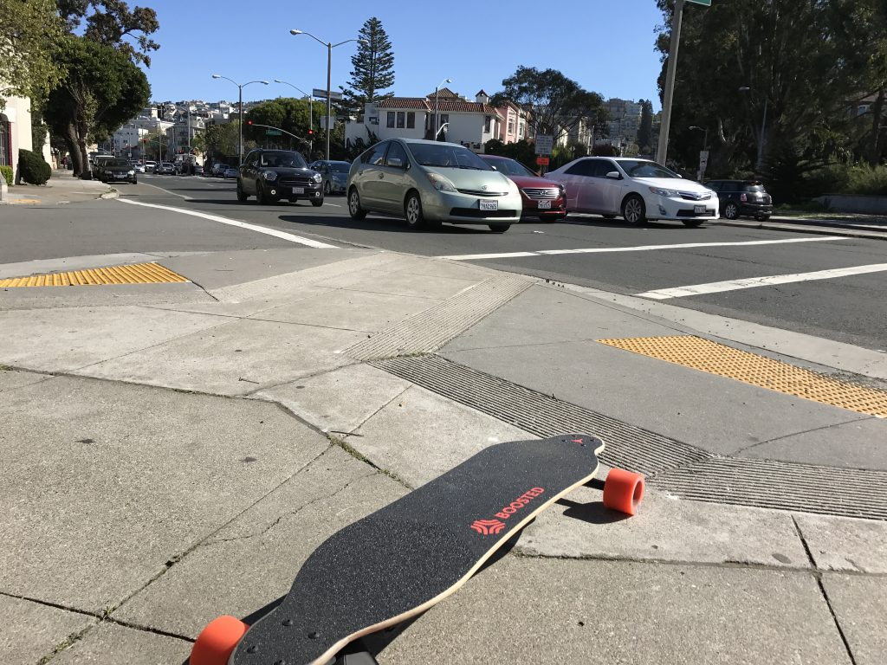
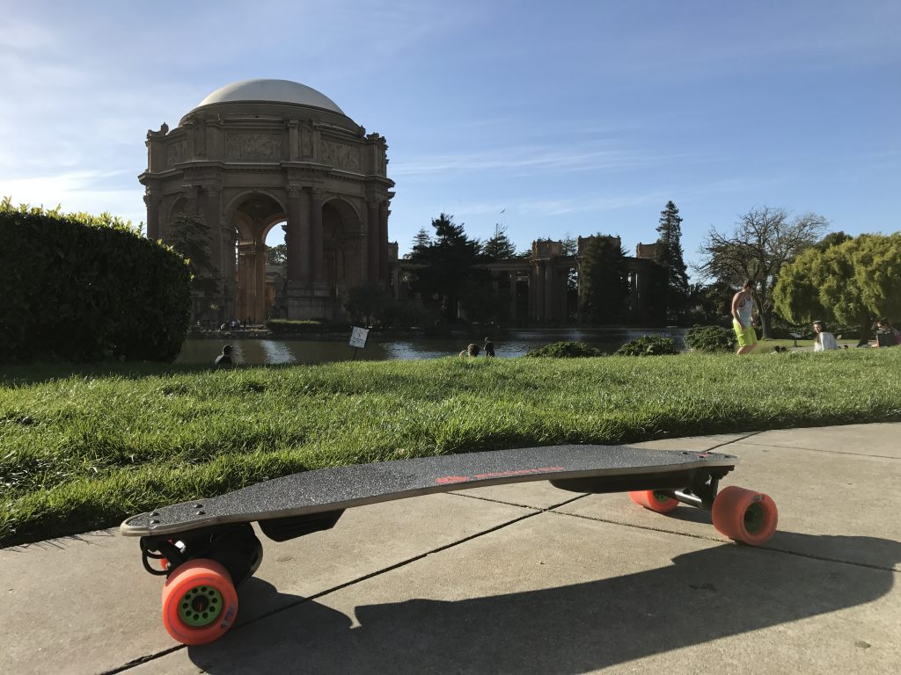
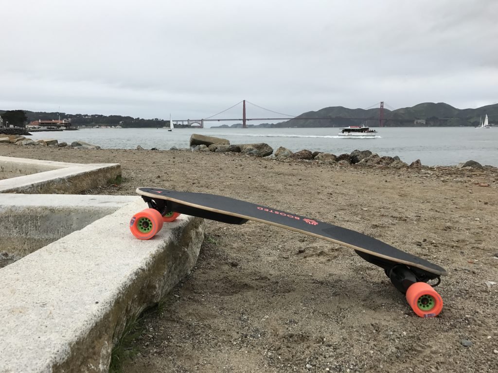
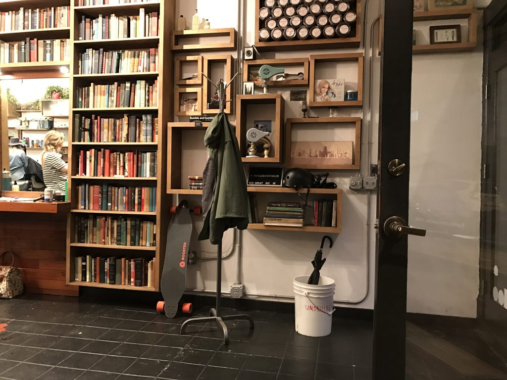

Snad nikdy jsem ještě na svém blogu nerecenzoval něčí výrobek ale dneska udělám výjimku, protože **Boosted Board si to zaslouží**. Poslední dobou se rozmáhá nový trend elektrických skateboardů, longboardů, hoverboardů, segwayí (ty teda tak nové už nejsou), one wheelů a dalších podivných gadgetů, které mají výkonné motorky a baterie. Je to hodně viditelné v San Francicsu, kde je:

- příznivé počasí
- neustálá potřeba se dopravovat na krátké vzdálenosti (3-8km)
- extrémně drahé parkování a vlastnictví auta
- pochybné MHD
- spousta pruhů pro kola
- kopce (což je otravné pro kolo ale v pohodě pro elektro pohyblovátka)
- lidé co rádi utrácí peníze za gadgety
- ok silnice, jsou tu sice díry a praskliny ale aspoň ne kočičí hlavy

Před pár lety se k tomu přidaly výrazné pokroky v oblasti výkonu baterií a motorů a na kickstarteru se tak objevil projekt od studentů Stanfordu s názvem [Boosted Board](https://www.kickstarter.com/projects/170315130/boosted-boards-the-worlds-lightest-electric-vehicl). **Longboard, který váží 6,8kg, ujede 10km rychlostí až 35km/h a nelekne se ani 25% stoupání.** Navíc umí regenerativně brzdit. Od té doby se stal synonymem a definicí pro celou kategorii elektrických boardů.

V loni v létě jsem ho měl v SF půjčený na celý den a  po té co jsem ho vrátil, jsem věděl, že ho musím mít. Problém je, že Boosted Board je dodnes nedostatkové zboží a čeká se na něj v pořadníku. **Předobjednal jsem verzi v2 Dual+ v říjnu 2016 a doručen byl až začátkem března 2017**. Do teď jsem najel něco přes 300 km. Dojmy?

<figure class="floatLeft">
  
</figure>

**Stoupnout na longboard není jen tak.** A na takový, který má na sobě 2000W motory už vůbec ne. Proto jsem si koupil i obyčejný longboard, abych se naučil základy (kick push, brždění, balanc, zatáčení...) a taky si zkrátil čekání na BB. Je to docela zábava i bez pohonu, ale na delší vzdálenosti to unaví víc než kolo. Pokud o e-boardu uvažujete, určitě je dobrý nápad to nejdříve zkusit na tom obyčejném.

**Boosted Board se ovládá pomocí bezdrátového bluetooth ovladače a má 4 různé módy - Beginner, Eco, Expert a Pro**. Ty jsou omezené rychlostí, akcelerací a dojezdem.  Potíž však je, že je pochopitelně omezené i brždění a například z prudkého kopce by mě board v Eco módu úplně nezastavil. V provozu je kratší brzdná dráha taky důležitá. Je tak dobré se co nejrychleji otrkat a začít používat Expert nebo Pro. Což se sice snadno říká ale výkon, který máte pod palcem je doslova smrtící. Pokud byste na board stoupli poprvé a zkusili se rozjet v režimu Pro, tak je skoro jistota že skončíte na zádech. Narozdíl od obyčejného longboardu je potřeba se naučit naklánět proti zrychlování/zpomalování a to nějakou chvíli trvá. Ovladač je v pokročilých módech také daleko citlivější a i při středních rychlostech dokáže board ještě pořádně zrychlit. Zrychlení je opravdu neuvěřitelné a každého hodně překvapí.

<figure class="floatRight">
  
</figure>

Longboard je také daleko citlivější na nerovnosti oproti kolům a musíte si dost dávat pozor na to, co máte před sebou. Nicméně 80mm kola jsou docela velká a dokáží tak přejet lecos (například i tramvajové koleje). Výhoda BB oproti ostatním boardům na trhu je to že používá špičkové bambusové prkno od Loaded, které pruží jako trampolína a mírní tak narázy.

**První dny ježdění bolí.** Musíte se hodně opírat o nohy s pokrčenými koleny a tělo si zvyká. Navíc pocit, že každou chvíli umřete vás trochu zakřečuje. První jízdu do práce jsem musel asi 5x zastavit a spotil jsem se paradoxně víc než na kole. Nicméně po nějakých 2 týdnech si tělo zvykne, uvolníte se a jezdit zvládnete klidně celý den. Postupně vás přestanou bavit pomalejší módy a nakonec se otrkáte tak, že jezdíte už jen na pro, předjíždíte cyklisty a mezi světlama to naložíte i autům. Boosted Board je v první řadě pořád špičkový longboard (prkno, trucky, kola...) a tak se s ním dá dělat i víc než jen jezdit rovně - carvovat. Když se otevře pěkný kus asfaltu tak to přímo vybízí začít dělat obloučky. Ježdění na BB je stejně návykové podobně jako třeba lyžování.

<figure class="floatLeft">
  
</figure>

**Každý den ho používám na cestu z a do práce, což je dohromady přesně 9km**.  A každý den se na to těším. Jedna cesta mi zabere 15 minut. Je to rychlejší než kolo, uber nebo MHD a navíc ještě parádní dávka zábavy a adrenalinu. O víkendech mám pak čas i na nějaké blbnutí v různých částech města a nemusím brát ohled na výdrž. Nicméně koupil jsem si do práce náhradní nabíječku, takže se nemusím omezovat už ani při cestě do ní. **Kompletně se nabije se za 1h**. Můžete si tak vzít nabíječku do batohu a zastavovat po kavárnách.

<figure class="floatRight">
  
</figure>

**Pády. V anglickém slangu: "Eating shit"**. Dřív, či později to přijde. S novým boardem se mi to zatím ještě nestalo. V létě s půjčeným jsem se ale solidně vysekal hned po 15 minutách, když jsem dostal speed wobble (ve vyšší rychlosti a váze na zadní noze se vám může board rozvlnit a je těžké ho uklidnit). **Do nějaké rychlosti se dá případný pád vyběhnout. Bohužel nad 20km/h vás už setrvačnost dožene a na řadě je tak kotrmelec někam do roští, což není úplně ideální.** Mezi autama, kde ani to roští není... **no, je fakt dobré mít helmu**. Jezdit na BB bez ní je pro sebevrahy. Téměř vždycky ještě nosím wrist guards (chrániče zápěstí). Sedřená kolena nebo lokty je něco co se dá přežít, ale zlomené zápěstí už může být dost průser.

**BB je postavený tak, aby vydržel. Nicméně neobejde se bez jisté údržby**. Je potřeba měnit ložiska a pásy každých cca 400km (motor je zpřevodovaný). Po nějakých 1500 km i kola. Board zvládne vodu, ale na mokrém povrchu ztrácí úplně trakci a vysekali byste se tak v první zatáčce (naštěstí v SF moc neprší). Jeden z hlavních důvodů proč BB je i to, že mají sídlo blízko SF a zároveň špičkový support (zdarma opravují a vyměňují i dávno po vypršení záruky).

<figure class="floatLeft">
  <iframe width="420" height="315" src="https://www.youtube.com/embed/VmJ-CiHRpOo" frameborder="0" allowfullscreen></iframe>
</figure>

**Upřímně, $1,500 je fůra peněz za něco jako skateboard**. Nicměně přestože BB je extrémně zábavný, tak to není hračka! Je to především ultimátní dopravní prostředek. Nabízí úplně novou dimenzi v podobě svobody pohybu. Beru ho už úplně všude - do práce, nákupy, večeře, holičství, kavárny, k zubařovi, parku, na poštu... Není potřeba přemýšlet o tom, kde ho zamknout jako kolo. Jednoduše ho máte pořád u sebe. Na jedno nabití v pohodě přejede celé město. Ve většině případů navíc rychleji než taxík! Všechno je najednou hrozně blízko. Zásadně zasáhne do vašeho každodenního života. **A na to nemůžete dát cenovku!**